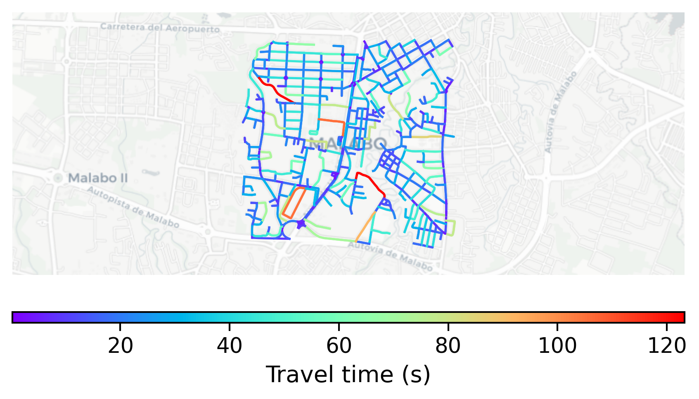

# Malabo, Equatorial Guinea

#### Location Information

- **City**: Malabo
- **Country**: Equatorial Guinea
- **Data Source**: OpenStreetMap

- **Analysis Date**: 2025-10-10

#### Road network topology

#### Network Characteristics

##### Basic Topology

- **Number of Nodes**: 463
- **Number of Edges**: 1,129
- **Network Density**: 0.005278
- **Average Node Degree**: 4.877
- **Standard Deviation of Node Degrees**: 1.833

##### Clustering Properties

- **Global Clustering Coefficient**: 0.047431
- **Average Local Clustering Coefficient**: 0.057471
- **Degree Assortativity Coefficient**: 0.100608

##### Spatial Metrics

- **Total Network Length (meters)**: 118712.81
- **Average Edge Length (meters)**: 105.15
- **Average Travel Time per Edge (seconds)**: 22.01

---
*Report generated on 2025-10-10 16:06:55*
