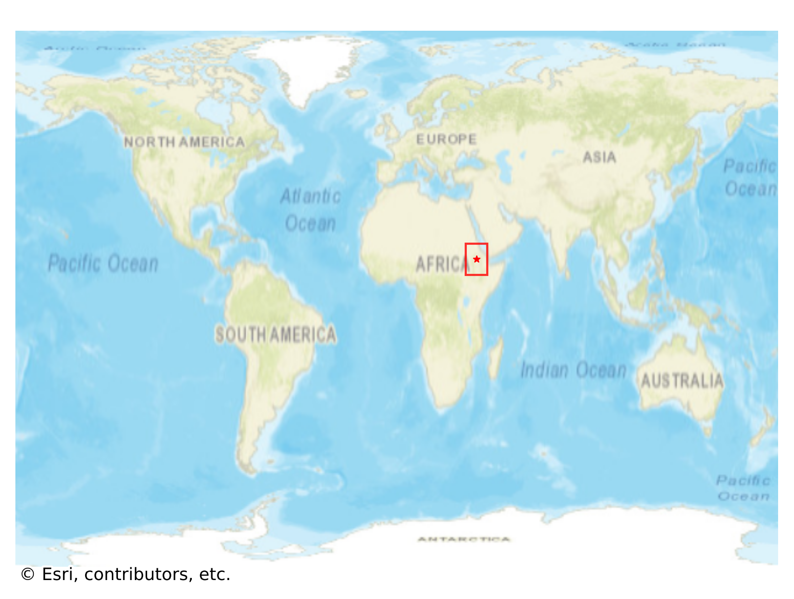
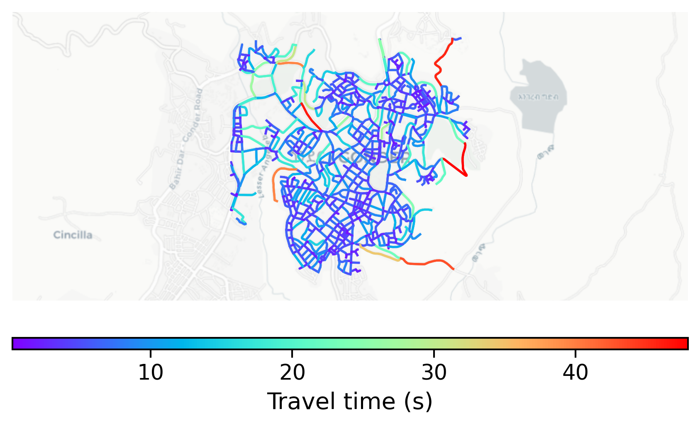

# Gonder, Ethiopia

#### Location Information

- **City**: Gonder
- **Country**: Ethiopia
- **Data Source**: OpenStreetMap

- **Analysis Date**: 2025-10-09

#### Road network topology

#### Network Characteristics

##### Basic Topology

- **Number of Nodes**: 803
- **Number of Edges**: 2,230
- **Network Density**: 0.003463
- **Average Node Degree**: 5.554
- **Standard Deviation of Node Degrees**: 1.586

##### Clustering Properties

- **Global Clustering Coefficient**: 0.034927
- **Average Local Clustering Coefficient**: 0.033890
- **Degree Assortativity Coefficient**: 0.186883

##### Spatial Metrics

- **Total Network Length (meters)**: 181545.50
- **Average Edge Length (meters)**: 81.41
- **Average Travel Time per Edge (seconds)**: 5.64

---
*Report generated on 2025-10-09 19:17:52*
