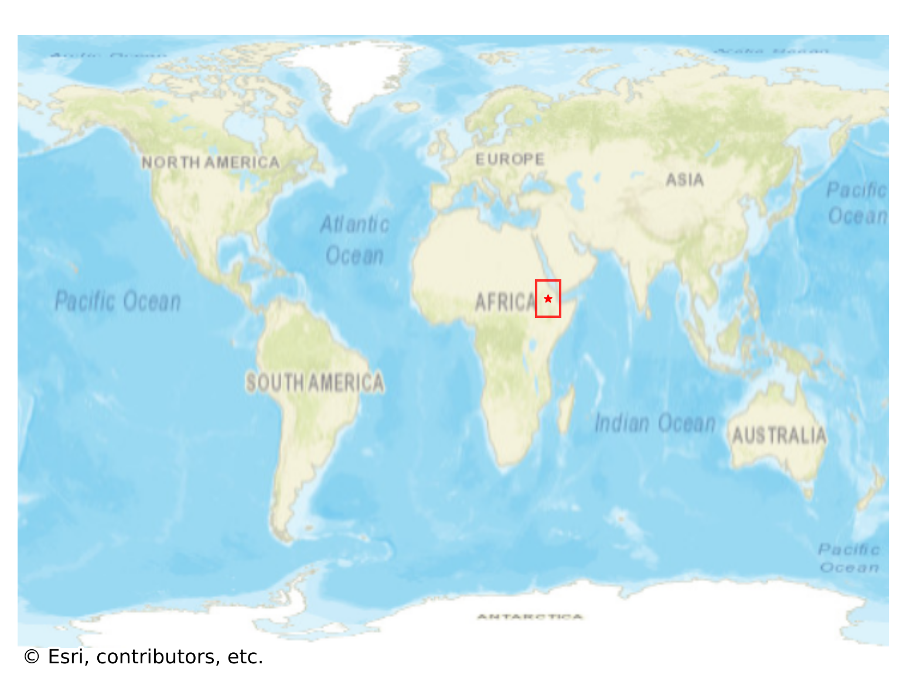
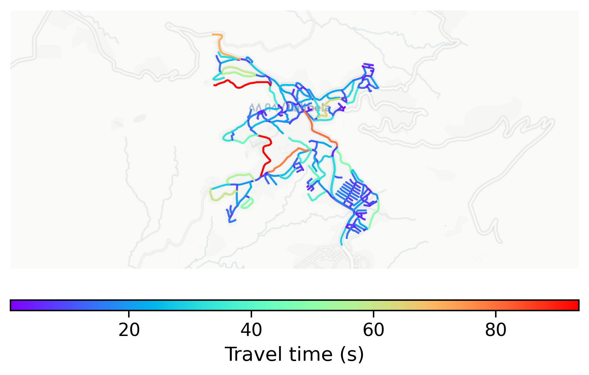

# Lalibela, Ethiopia

#### Location Information

- **City**: Lalibela
- **Country**: Ethiopia
- **Data Source**: OpenStreetMap

- **Analysis Date**: 2025-10-10

#### Road network topology

#### Network Characteristics

##### Basic Topology

- **Number of Nodes**: 229
- **Number of Edges**: 566
- **Network Density**: 0.010840
- **Average Node Degree**: 4.943
- **Standard Deviation of Node Degrees**: 1.989

##### Clustering Properties

- **Global Clustering Coefficient**: 0.059459
- **Average Local Clustering Coefficient**: 0.058586
- **Degree Assortativity Coefficient**: -0.219636

##### Spatial Metrics

- **Total Network Length (meters)**: 69321.64
- **Average Edge Length (meters)**: 122.48
- **Average Travel Time per Edge (seconds)**: 14.70

---
*Report generated on 2025-10-10 16:07:01*
