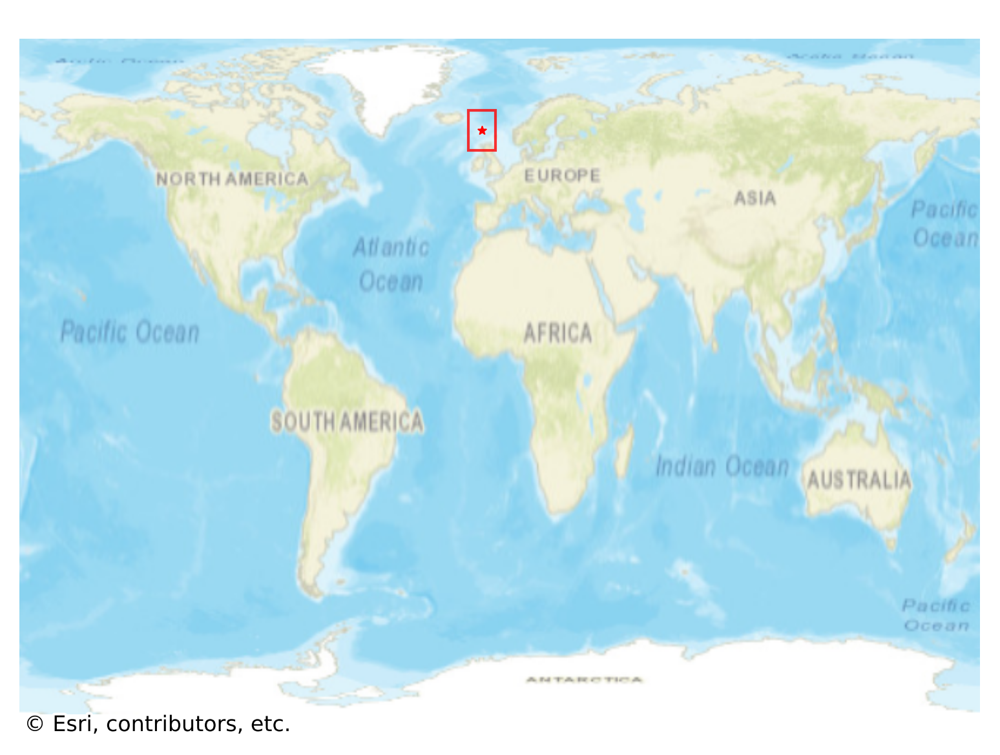
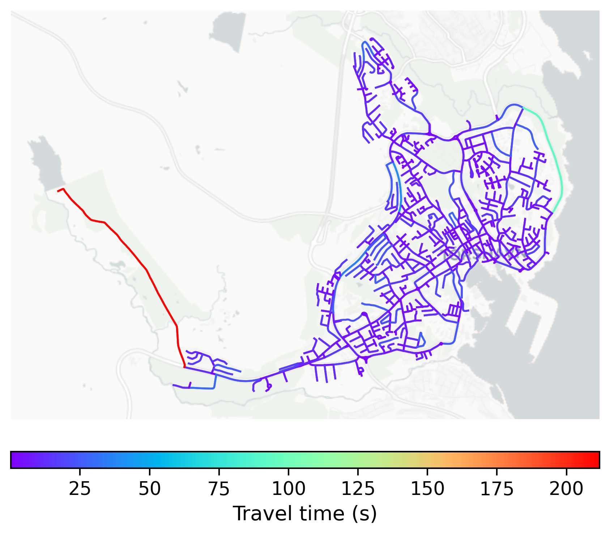

# Torshavn, Faroe Islands

#### Location Information

- **City**: Torshavn
- **Country**: Faroe Islands
- **Data Source**: OpenStreetMap

- **Analysis Date**: 2025-10-10

#### Road network topology

#### Network Characteristics

##### Basic Topology

- **Number of Nodes**: 837
- **Number of Edges**: 1,775
- **Network Density**: 0.002537
- **Average Node Degree**: 4.241
- **Standard Deviation of Node Degrees**: 1.990

##### Clustering Properties

- **Global Clustering Coefficient**: 0.072396
- **Average Local Clustering Coefficient**: 0.079080
- **Degree Assortativity Coefficient**: -0.143157

##### Spatial Metrics

- **Total Network Length (meters)**: 155635.26
- **Average Edge Length (meters)**: 87.68
- **Average Travel Time per Edge (seconds)**: 7.18

---
*Report generated on 2025-10-10 18:24:52*
