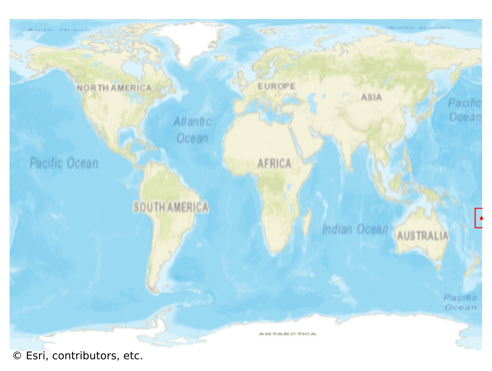

# Savusavu, Fiji

#### Location Information

- **City**: Savusavu
- **Country**: Fiji
- **Data Source**: OpenStreetMap

- **Analysis Date**: 2025-10-09

#### Road network topology

#### Network Characteristics

##### Basic Topology

- **Number of Nodes**: 100
- **Number of Edges**: 206
- **Network Density**: 0.020808
- **Average Node Degree**: 4.120
- **Standard Deviation of Node Degrees**: 1.991

##### Clustering Properties

- **Global Clustering Coefficient**: 0.037736
- **Average Local Clustering Coefficient**: 0.035714
- **Degree Assortativity Coefficient**: -0.232321

##### Spatial Metrics

- **Total Network Length (meters)**: 46027.36
- **Average Edge Length (meters)**: 223.43
- **Average Travel Time per Edge (seconds)**: 26.81

---
*Report generated on 2025-10-09 19:18:00*
