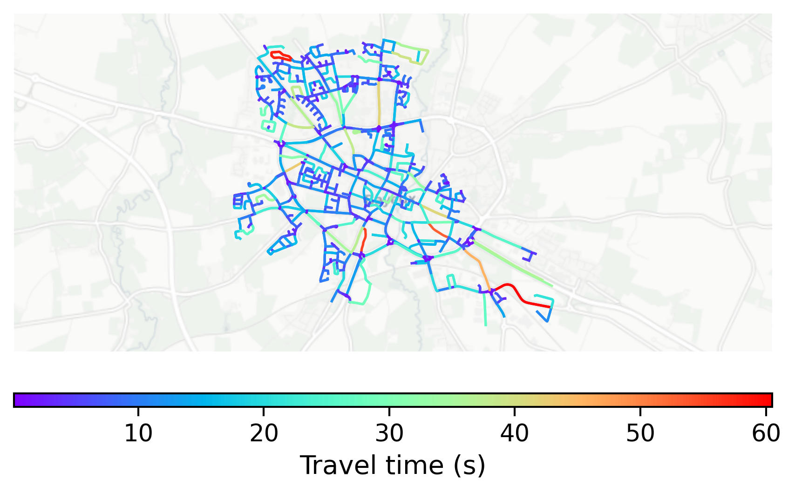

# Bayeux, France

#### Location Information

- **City**: Bayeux
- **Country**: France
- **Data Source**: OpenStreetMap

- **Analysis Date**: 2025-10-10

#### Road network topology

#### Network Characteristics

##### Basic Topology

- **Number of Nodes**: 662
- **Number of Edges**: 1,429
- **Network Density**: 0.003266
- **Average Node Degree**: 4.317
- **Standard Deviation of Node Degrees**: 1.620

##### Clustering Properties

- **Global Clustering Coefficient**: 0.115385
- **Average Local Clustering Coefficient**: 0.108856
- **Degree Assortativity Coefficient**: 0.144924

##### Spatial Metrics

- **Total Network Length (meters)**: 130341.37
- **Average Edge Length (meters)**: 91.21
- **Average Travel Time per Edge (seconds)**: 8.78

---
*Report generated on 2025-10-10 16:07:09*
