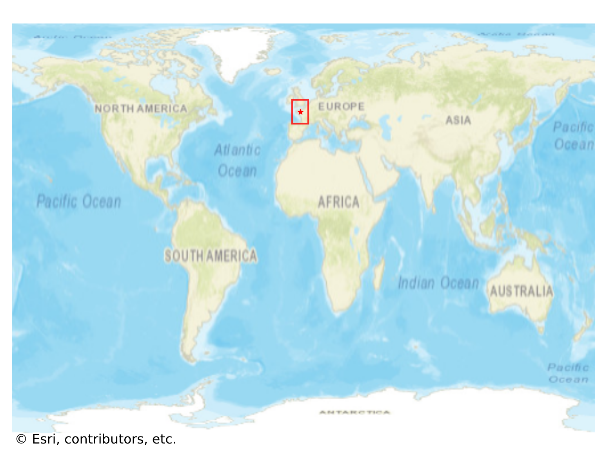

# Dinan, France

#### Location Information

- **City**: Dinan
- **Country**: France
- **Data Source**: OpenStreetMap

- **Analysis Date**: 2025-10-10

#### Road network topology

#### Network Characteristics

##### Basic Topology

- **Number of Nodes**: 760
- **Number of Edges**: 1,621
- **Network Density**: 0.002810
- **Average Node Degree**: 4.266
- **Standard Deviation of Node Degrees**: 1.651

##### Clustering Properties

- **Global Clustering Coefficient**: 0.072748
- **Average Local Clustering Coefficient**: 0.072881
- **Degree Assortativity Coefficient**: 0.087512

##### Spatial Metrics

- **Total Network Length (meters)**: 149640.26
- **Average Edge Length (meters)**: 92.31
- **Average Travel Time per Edge (seconds)**: 10.81

---
*Report generated on 2025-10-10 16:07:11*
