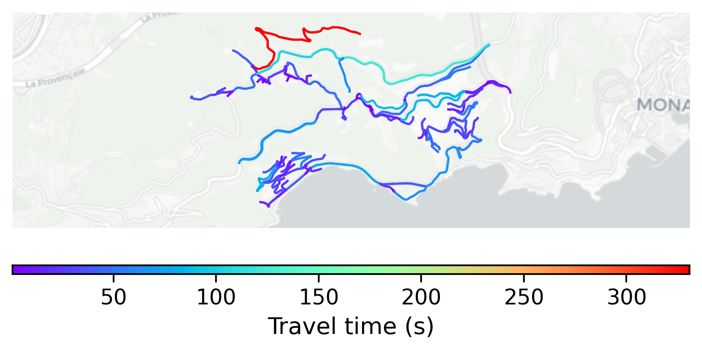

# Eze, France

#### Location Information

- **City**: Eze
- **Country**: France
- **Data Source**: OpenStreetMap

- **Analysis Date**: 2025-10-09

#### Road network topology

#### Network Characteristics

##### Basic Topology

- **Number of Nodes**: 118
- **Number of Edges**: 246
- **Network Density**: 0.017818
- **Average Node Degree**: 4.169
- **Standard Deviation of Node Degrees**: 1.815

##### Clustering Properties

- **Global Clustering Coefficient**: 0.096330
- **Average Local Clustering Coefficient**: 0.080247
- **Degree Assortativity Coefficient**: -0.134825

##### Spatial Metrics

- **Total Network Length (meters)**: 74188.60
- **Average Edge Length (meters)**: 301.58
- **Average Travel Time per Edge (seconds)**: 28.15

---
*Report generated on 2025-10-09 19:18:09*
