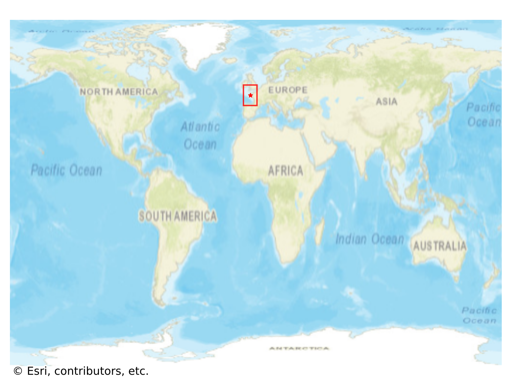
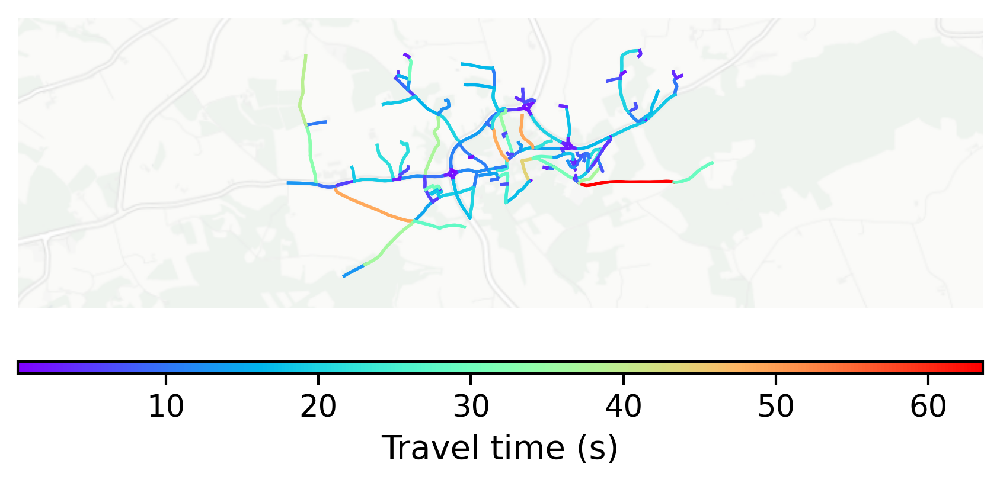

# Locronan, France

#### Location Information

- **City**: Locronan
- **Country**: France
- **Data Source**: OpenStreetMap

- **Analysis Date**: 2025-10-10

#### Road network topology

#### Network Characteristics

##### Basic Topology

- **Number of Nodes**: 168
- **Number of Edges**: 347
- **Network Density**: 0.012368
- **Average Node Degree**: 4.131
- **Standard Deviation of Node Degrees**: 1.768

##### Clustering Properties

- **Global Clustering Coefficient**: 0.113043
- **Average Local Clustering Coefficient**: 0.111570
- **Degree Assortativity Coefficient**: 0.034547

##### Spatial Metrics

- **Total Network Length (meters)**: 51998.32
- **Average Edge Length (meters)**: 149.85
- **Average Travel Time per Edge (seconds)**: 12.10

---
*Report generated on 2025-10-10 16:07:14*
