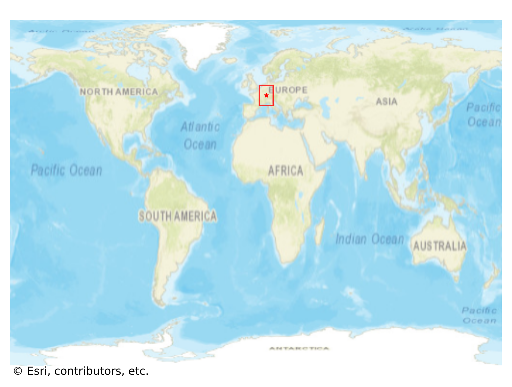
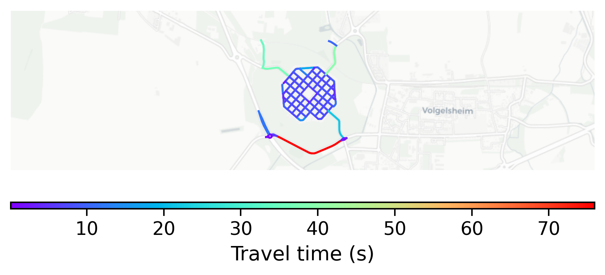

# NeufBrisach, France

#### Location Information

- **City**: NeufBrisach
- **Country**: France
- **Data Source**: OpenStreetMap

- **Analysis Date**: 2025-10-10

#### Road network topology

#### Network Characteristics

##### Basic Topology

- **Number of Nodes**: 93
- **Number of Edges**: 263
- **Network Density**: 0.030739
- **Average Node Degree**: 5.656
- **Standard Deviation of Node Degrees**: 2.066

##### Clustering Properties

- **Global Clustering Coefficient**: 0.092437
- **Average Local Clustering Coefficient**: 0.131086
- **Degree Assortativity Coefficient**: 0.469992

##### Spatial Metrics

- **Total Network Length (meters)**: 19167.29
- **Average Edge Length (meters)**: 72.88
- **Average Travel Time per Edge (seconds)**: 8.31

---
*Report generated on 2025-10-10 18:25:03*
