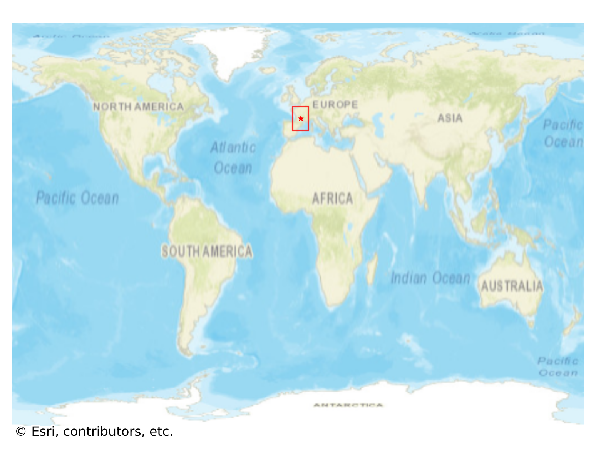
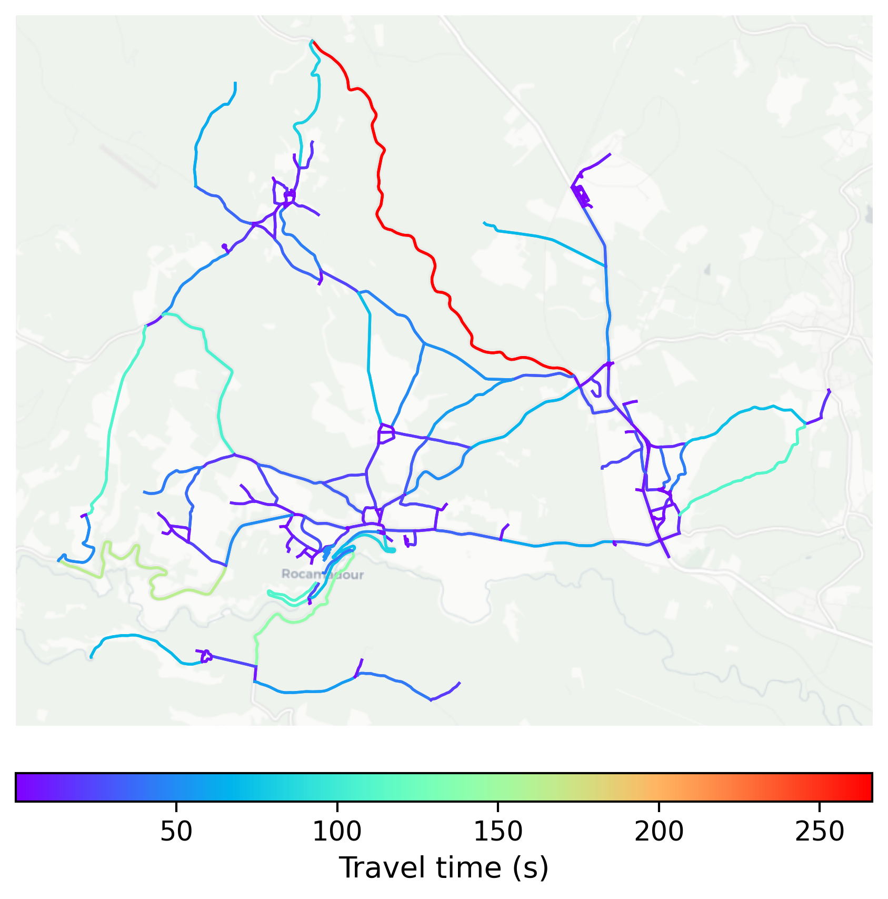

# Rocamadour, France

#### Location Information

- **City**: Rocamadour
- **Country**: France
- **Data Source**: OpenStreetMap

- **Analysis Date**: 2025-10-10

#### Road network topology

#### Network Characteristics

##### Basic Topology

- **Number of Nodes**: 237
- **Number of Edges**: 574
- **Network Density**: 0.010262
- **Average Node Degree**: 4.844
- **Standard Deviation of Node Degrees**: 1.730

##### Clustering Properties

- **Global Clustering Coefficient**: 0.107143
- **Average Local Clustering Coefficient**: 0.107130
- **Degree Assortativity Coefficient**: 0.014303

##### Spatial Metrics

- **Total Network Length (meters)**: 179973.19
- **Average Edge Length (meters)**: 313.54
- **Average Travel Time per Edge (seconds)**: 16.33

---
*Report generated on 2025-10-10 18:25:05*
