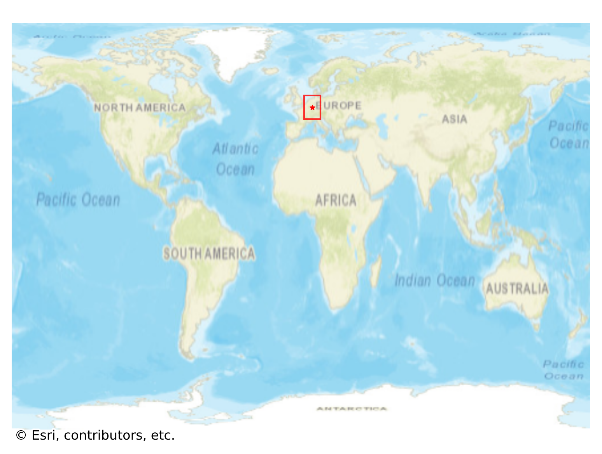
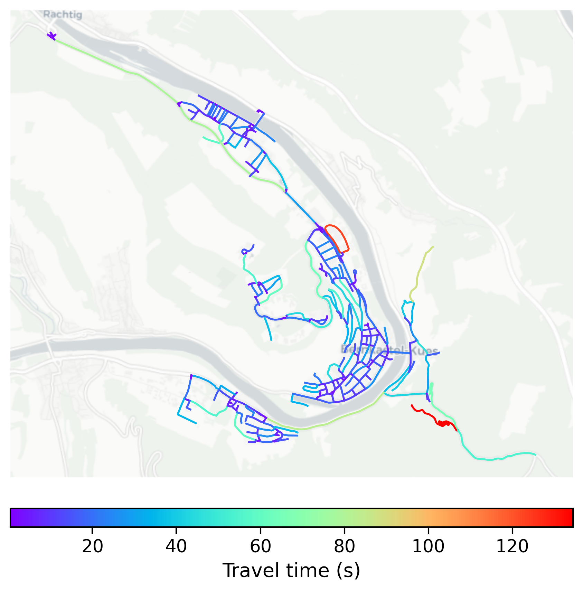

# BernkastelKues, Germany

#### Location Information

- **City**: BernkastelKues
- **Country**: Germany
- **Data Source**: OpenStreetMap

- **Analysis Date**: 2025-10-10

#### Road network topology

#### Network Characteristics

##### Basic Topology

- **Number of Nodes**: 312
- **Number of Edges**: 732
- **Network Density**: 0.007544
- **Average Node Degree**: 4.692
- **Standard Deviation of Node Degrees**: 1.762

##### Clustering Properties

- **Global Clustering Coefficient**: 0.100671
- **Average Local Clustering Coefficient**: 0.116327
- **Degree Assortativity Coefficient**: 0.019021

##### Spatial Metrics

- **Total Network Length (meters)**: 116543.66
- **Average Edge Length (meters)**: 159.21
- **Average Travel Time per Edge (seconds)**: 15.21

---
*Report generated on 2025-10-10 16:07:21*
