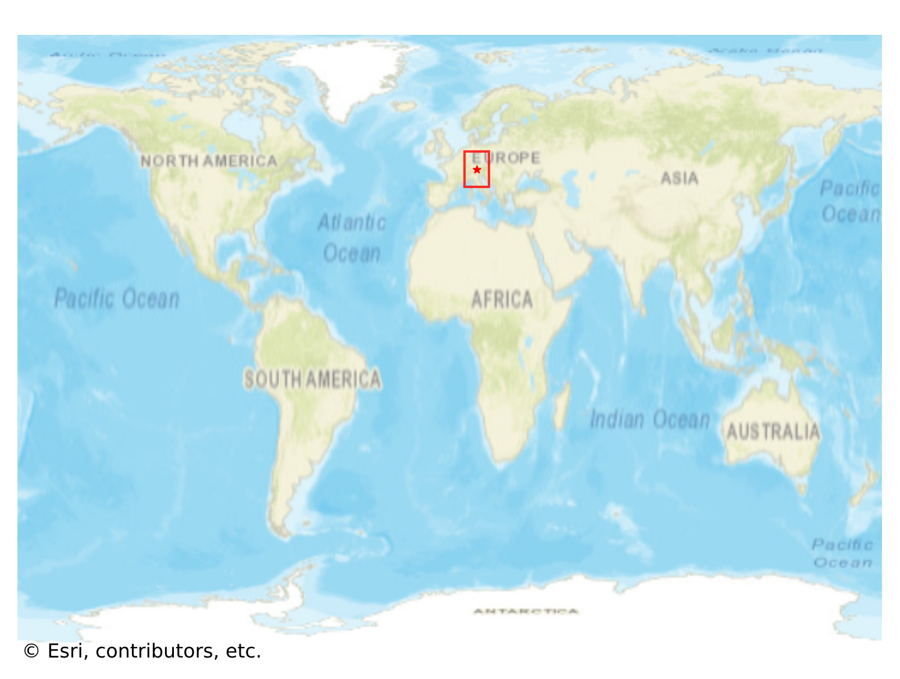
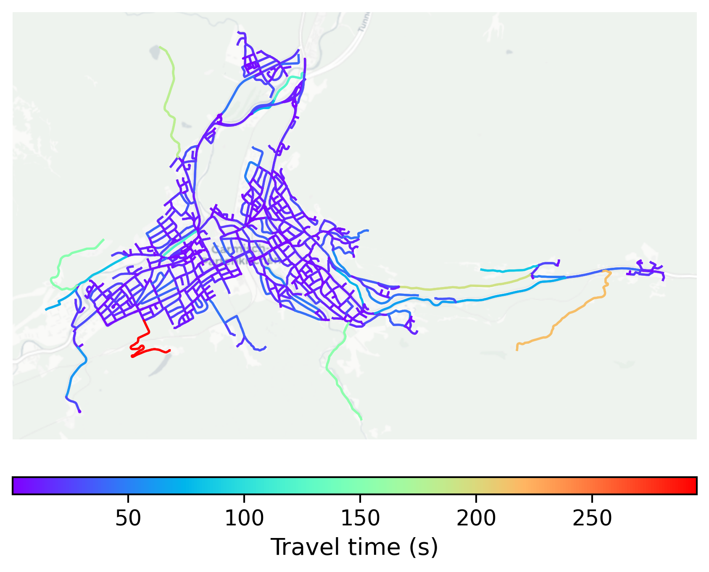

# GarmischPartenkirchen, Germany

#### Location Information

- **City**: GarmischPartenkirchen
- **Country**: Germany
- **Data Source**: OpenStreetMap

- **Analysis Date**: 2025-10-09

#### Road network topology

#### Network Characteristics

##### Basic Topology

- **Number of Nodes**: 822
- **Number of Edges**: 2,081
- **Network Density**: 0.003084
- **Average Node Degree**: 5.063
- **Standard Deviation of Node Degrees**: 1.748

##### Clustering Properties

- **Global Clustering Coefficient**: 0.084100
- **Average Local Clustering Coefficient**: 0.084094
- **Degree Assortativity Coefficient**: 0.056768

##### Spatial Metrics

- **Total Network Length (meters)**: 263090.95
- **Average Edge Length (meters)**: 126.43
- **Average Travel Time per Edge (seconds)**: 12.50

---
*Report generated on 2025-10-09 19:18:19*
