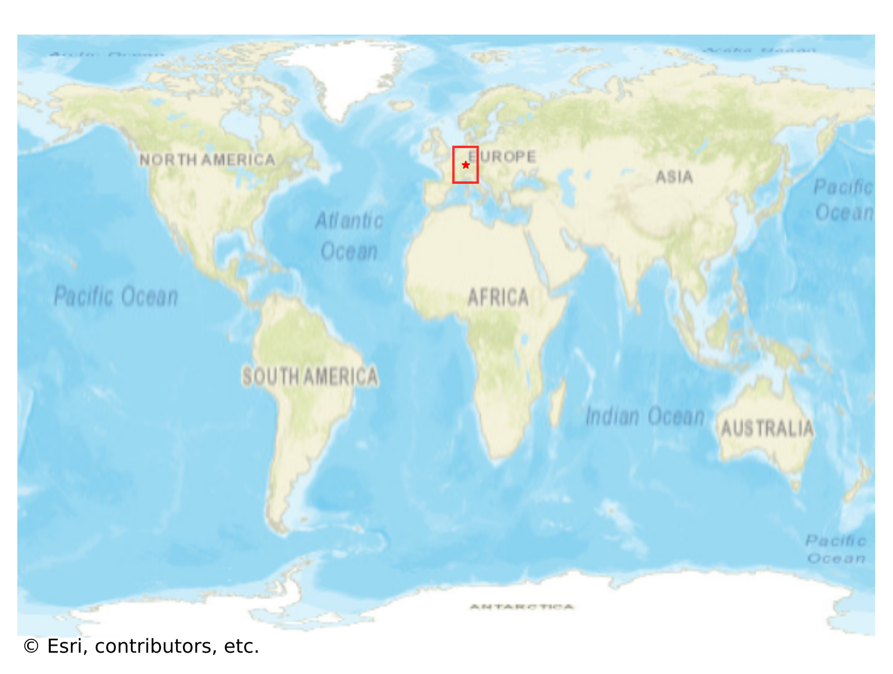
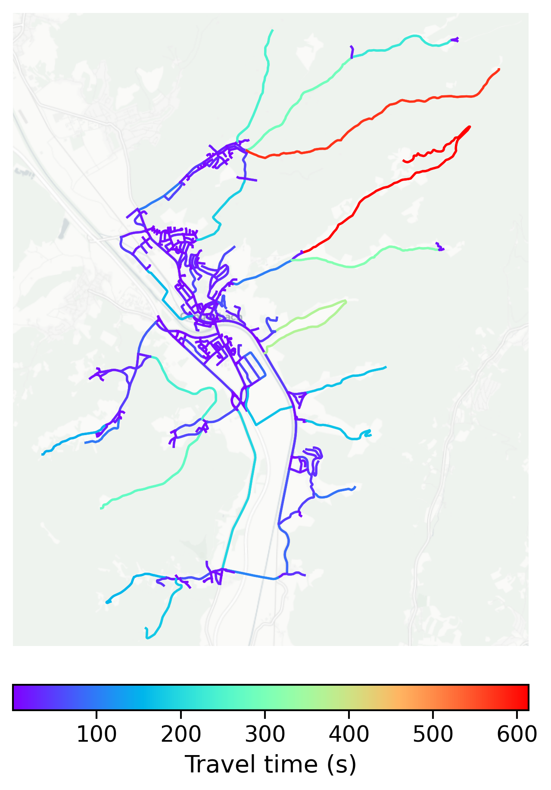

# Gengenbach, Germany

#### Location Information

- **City**: Gengenbach
- **Country**: Germany
- **Data Source**: OpenStreetMap

- **Analysis Date**: 2025-10-10

#### Road network topology

#### Network Characteristics

##### Basic Topology

- **Number of Nodes**: 462
- **Number of Edges**: 1,079
- **Network Density**: 0.005066
- **Average Node Degree**: 4.671
- **Standard Deviation of Node Degrees**: 1.907

##### Clustering Properties

- **Global Clustering Coefficient**: 0.061886
- **Average Local Clustering Coefficient**: 0.066563
- **Degree Assortativity Coefficient**: -0.150399

##### Spatial Metrics

- **Total Network Length (meters)**: 221232.97
- **Average Edge Length (meters)**: 205.04
- **Average Travel Time per Edge (seconds)**: 23.02

---
*Report generated on 2025-10-10 16:07:28*
