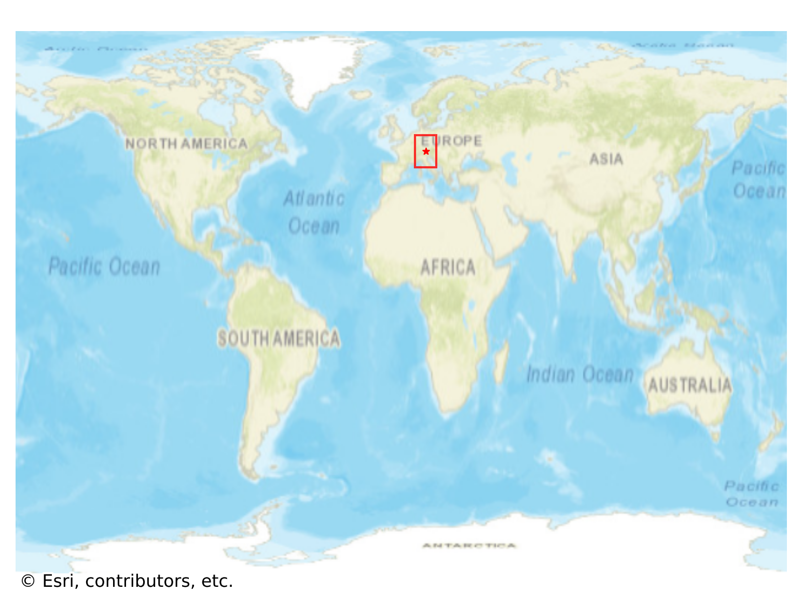

# Mittenwald, Germany

#### Location Information

- **City**: Mittenwald
- **Country**: Germany
- **Data Source**: OpenStreetMap

- **Analysis Date**: 2025-10-09

#### Road network topology

#### Network Characteristics

##### Basic Topology

- **Number of Nodes**: 265
- **Number of Edges**: 685
- **Network Density**: 0.009791
- **Average Node Degree**: 5.170
- **Standard Deviation of Node Degrees**: 1.691

##### Clustering Properties

- **Global Clustering Coefficient**: 0.071111
- **Average Local Clustering Coefficient**: 0.078440
- **Degree Assortativity Coefficient**: 0.011510

##### Spatial Metrics

- **Total Network Length (meters)**: 112574.78
- **Average Edge Length (meters)**: 164.34
- **Average Travel Time per Edge (seconds)**: 17.88

---
*Report generated on 2025-10-09 19:18:27*
