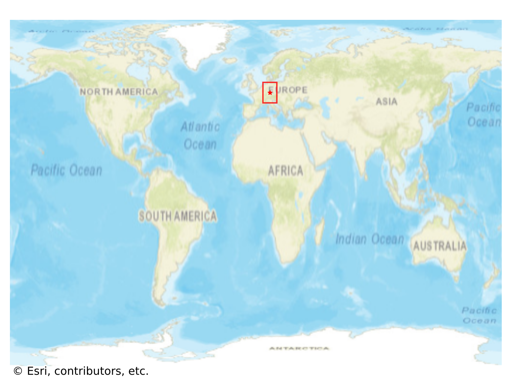

# Rothenburg_ob_der_Tauber, Germany

#### Location Information

- **City**: Rothenburg_ob_der_Tauber
- **Country**: Germany
- **Data Source**: OpenStreetMap

- **Analysis Date**: 2025-10-09

#### Road network topology

#### Network Characteristics

##### Basic Topology

- **Number of Nodes**: 588
- **Number of Edges**: 1,484
- **Network Density**: 0.004300
- **Average Node Degree**: 5.048
- **Standard Deviation of Node Degrees**: 1.772

##### Clustering Properties

- **Global Clustering Coefficient**: 0.070187
- **Average Local Clustering Coefficient**: 0.074543
- **Degree Assortativity Coefficient**: 0.079146

##### Spatial Metrics

- **Total Network Length (meters)**: 204354.82
- **Average Edge Length (meters)**: 137.71
- **Average Travel Time per Edge (seconds)**: 15.34

---
*Report generated on 2025-10-09 19:18:32*
