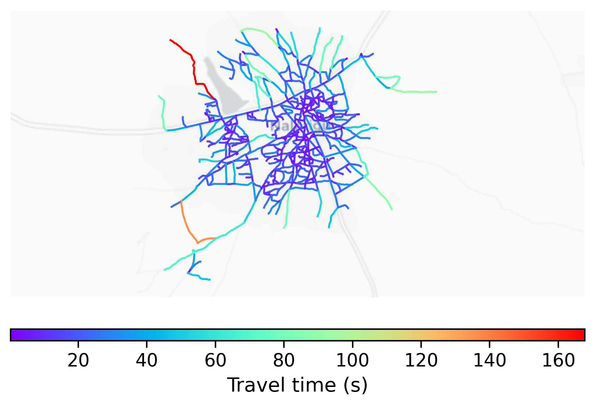

# Nalerigu, Ghana

#### Location Information

- **City**: Nalerigu
- **Country**: Ghana
- **Data Source**: OpenStreetMap

- **Analysis Date**: 2025-10-10

#### Road network topology

#### Network Characteristics

##### Basic Topology

- **Number of Nodes**: 517
- **Number of Edges**: 1,460
- **Network Density**: 0.005473
- **Average Node Degree**: 5.648
- **Standard Deviation of Node Degrees**: 1.648

##### Clustering Properties

- **Global Clustering Coefficient**: 0.082274
- **Average Local Clustering Coefficient**: 0.082017
- **Degree Assortativity Coefficient**: 0.014194

##### Spatial Metrics

- **Total Network Length (meters)**: 185299.91
- **Average Edge Length (meters)**: 126.92
- **Average Travel Time per Edge (seconds)**: 15.23

---
*Report generated on 2025-10-10 18:25:22*
