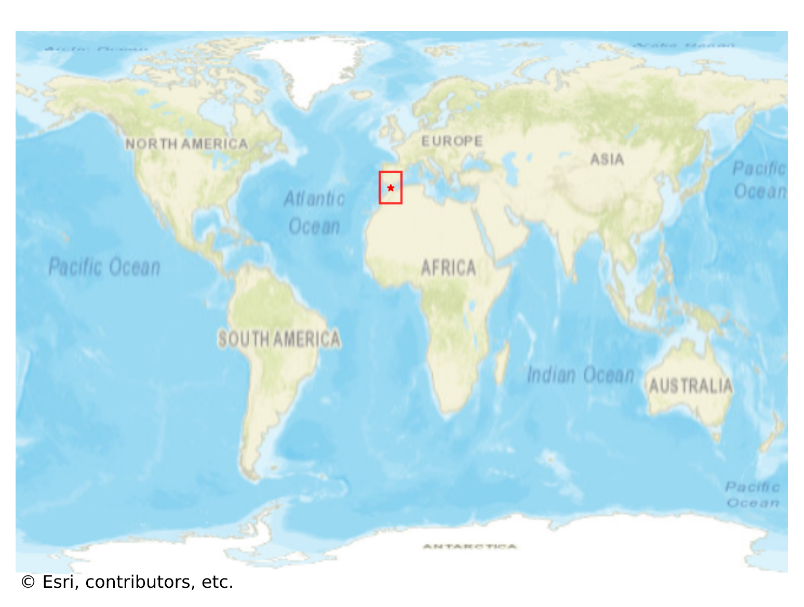
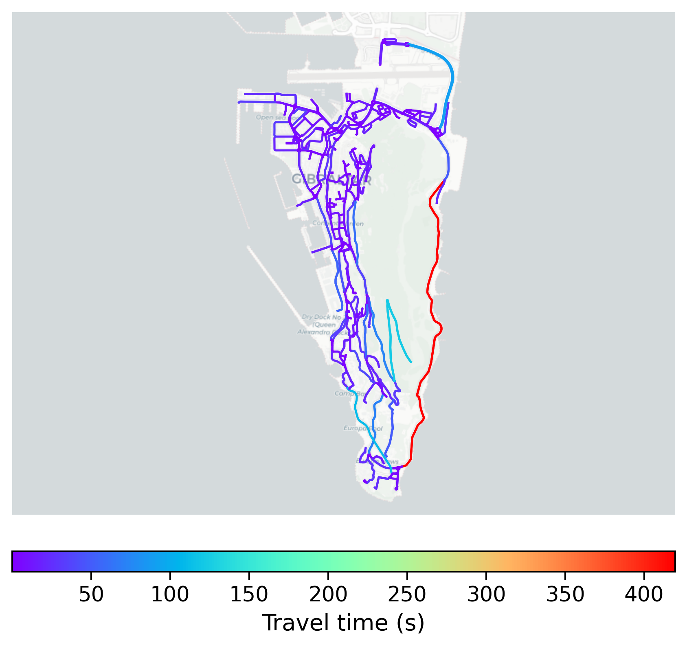

# Gibraltar, Gibraltar

#### Location Information

- **City**: Gibraltar
- **Country**: Gibraltar
- **Data Source**: OpenStreetMap

- **Analysis Date**: 2025-10-10

#### Road network topology

#### Network Characteristics

##### Basic Topology

- **Number of Nodes**: 429
- **Number of Edges**: 776
- **Network Density**: 0.004226
- **Average Node Degree**: 3.618
- **Standard Deviation of Node Degrees**: 1.228

##### Clustering Properties

- **Global Clustering Coefficient**: 0.120879
- **Average Local Clustering Coefficient**: 0.120018
- **Degree Assortativity Coefficient**: 0.173264

##### Spatial Metrics

- **Total Network Length (meters)**: 84578.12
- **Average Edge Length (meters)**: 108.99
- **Average Travel Time per Edge (seconds)**: 9.21

---
*Report generated on 2025-10-10 18:25:25*
