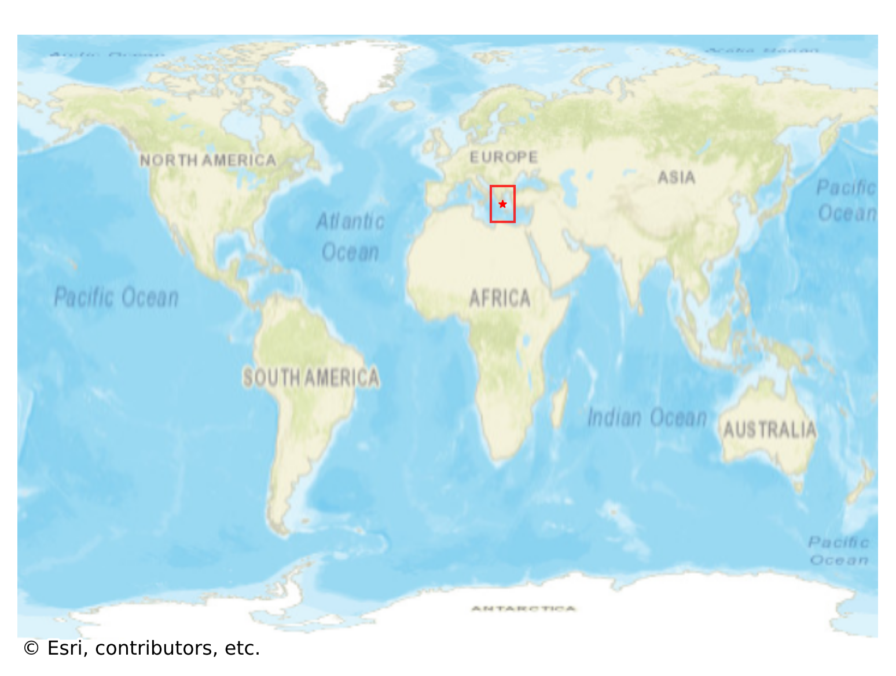
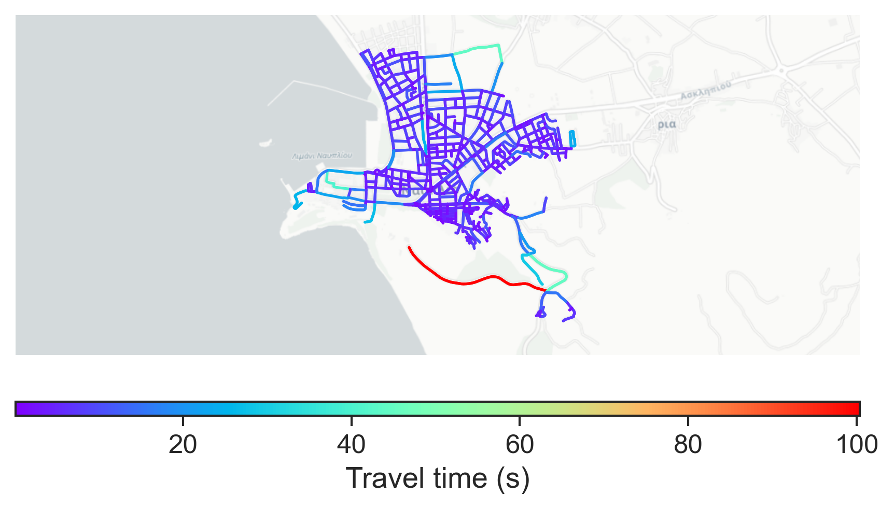

# Nafplio, Greece

#### Location Information

- **City**: Nafplio
- **Country**: Greece
- **Data Source**: OpenStreetMap

- **Analysis Date**: 2025-10-10

#### Road network topology

#### Network Characteristics

##### Basic Topology

- **Number of Nodes**: 532
- **Number of Edges**: 1,391
- **Network Density**: 0.004924
- **Average Node Degree**: 5.229
- **Standard Deviation of Node Degrees**: 1.826

##### Clustering Properties

- **Global Clustering Coefficient**: 0.052265
- **Average Local Clustering Coefficient**: 0.049639
- **Degree Assortativity Coefficient**: 0.244029

##### Spatial Metrics

- **Total Network Length (meters)**: 95264.39
- **Average Edge Length (meters)**: 68.49
- **Average Travel Time per Edge (seconds)**: 5.24

---
*Report generated on 2025-10-10 16:07:42*
