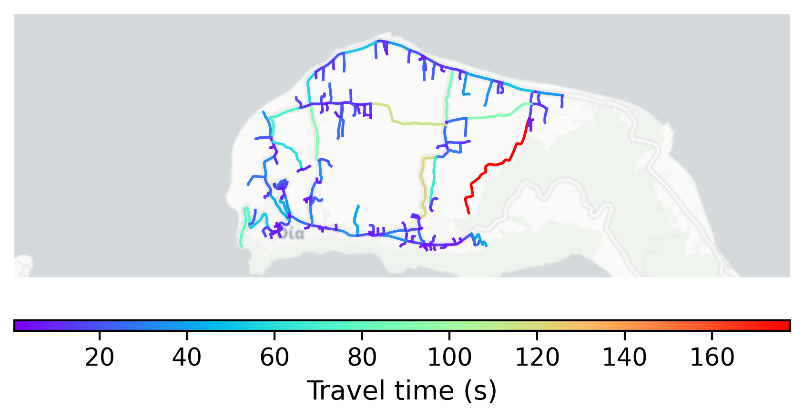

# Oia, Greece

#### Location Information

- **City**: Oia
- **Country**: Greece
- **Data Source**: OpenStreetMap

- **Analysis Date**: 2025-10-10

#### Road network topology

#### Network Characteristics

##### Basic Topology

- **Number of Nodes**: 219
- **Number of Edges**: 454
- **Network Density**: 0.009509
- **Average Node Degree**: 4.146
- **Standard Deviation of Node Degrees**: 1.990

##### Clustering Properties

- **Global Clustering Coefficient**: 0.024194
- **Average Local Clustering Coefficient**: 0.023035
- **Degree Assortativity Coefficient**: -0.135466

##### Spatial Metrics

- **Total Network Length (meters)**: 61141.88
- **Average Edge Length (meters)**: 134.67
- **Average Travel Time per Edge (seconds)**: 17.18

---
*Report generated on 2025-10-10 16:07:43*
