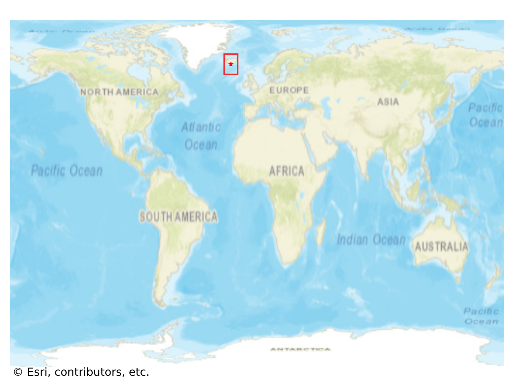
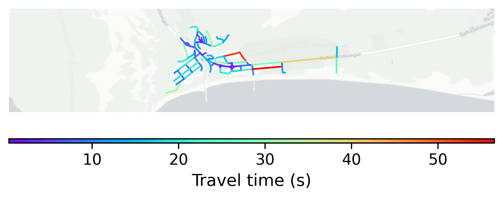

# Vík_í_Mýrdal, Iceland

#### Location Information

- **City**: Vík_í_Mýrdal
- **Country**: Iceland
- **Data Source**: OpenStreetMap

- **Analysis Date**: 2025-10-10

#### Road network topology

#### Network Characteristics

##### Basic Topology

- **Number of Nodes**: 98
- **Number of Edges**: 210
- **Network Density**: 0.022091
- **Average Node Degree**: 4.286
- **Standard Deviation of Node Degrees**: 1.879

##### Clustering Properties

- **Global Clustering Coefficient**: 0.139535
- **Average Local Clustering Coefficient**: 0.126866
- **Degree Assortativity Coefficient**: -0.050686

##### Spatial Metrics

- **Total Network Length (meters)**: 23785.65
- **Average Edge Length (meters)**: 113.27
- **Average Travel Time per Edge (seconds)**: 11.58

---
*Report generated on 2025-10-10 18:25:36*
