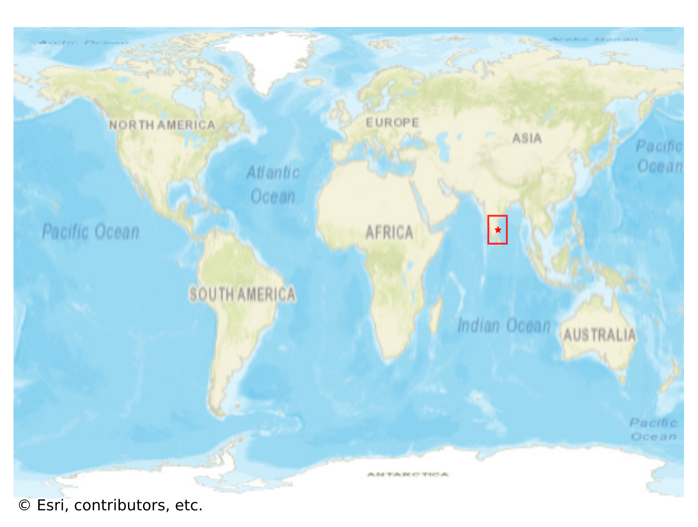
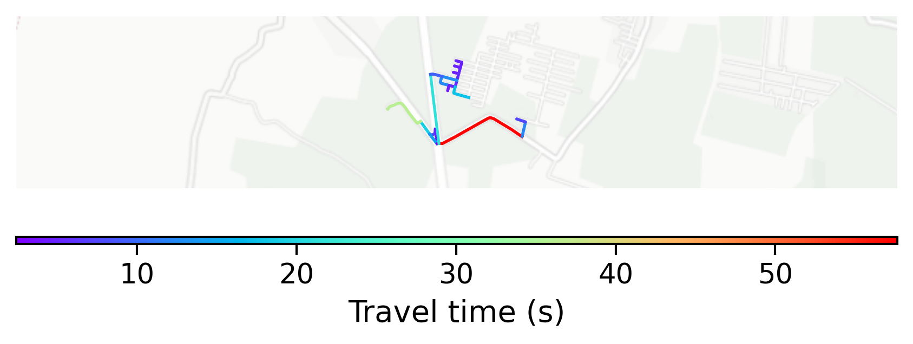

# Auroville, India

#### Location Information

- **City**: Auroville
- **Country**: India
- **Data Source**: OpenStreetMap

- **Analysis Date**: 2025-10-09

#### Road network topology

#### Network Characteristics

##### Basic Topology

- **Number of Nodes**: 22
- **Number of Edges**: 43
- **Network Density**: 0.093074
- **Average Node Degree**: 3.909
- **Standard Deviation of Node Degrees**: 1.649

##### Clustering Properties

- **Global Clustering Coefficient**: 0.090909
- **Average Local Clustering Coefficient**: 0.111111
- **Degree Assortativity Coefficient**: -0.046189

##### Spatial Metrics

- **Total Network Length (meters)**: 4862.09
- **Average Edge Length (meters)**: 113.07
- **Average Travel Time per Edge (seconds)**: 12.24

---
*Report generated on 2025-10-09 19:18:40*
