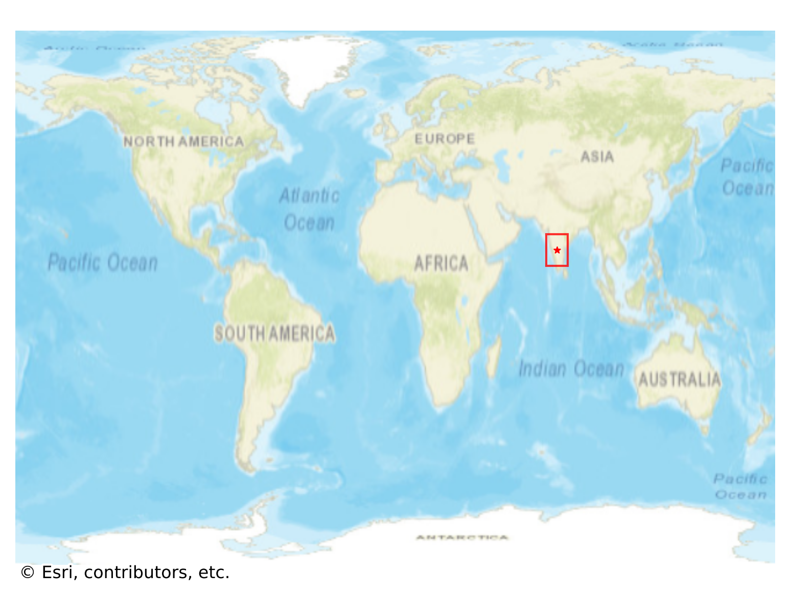
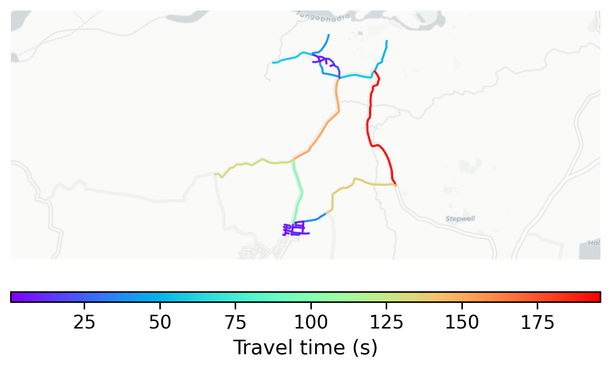

# Hampi, India

#### Location Information

- **City**: Hampi
- **Country**: India
- **Data Source**: OpenStreetMap

- **Analysis Date**: 2025-10-10

#### Road network topology

#### Network Characteristics

##### Basic Topology

- **Number of Nodes**: 45
- **Number of Edges**: 106
- **Network Density**: 0.053535
- **Average Node Degree**: 4.711
- **Standard Deviation of Node Degrees**: 1.985

##### Clustering Properties

- **Global Clustering Coefficient**: 0.033708
- **Average Local Clustering Coefficient**: 0.053763
- **Degree Assortativity Coefficient**: -0.133690

##### Spatial Metrics

- **Total Network Length (meters)**: 21346.13
- **Average Edge Length (meters)**: 201.38
- **Average Travel Time per Edge (seconds)**: 24.17

---
*Report generated on 2025-10-10 18:25:39*
