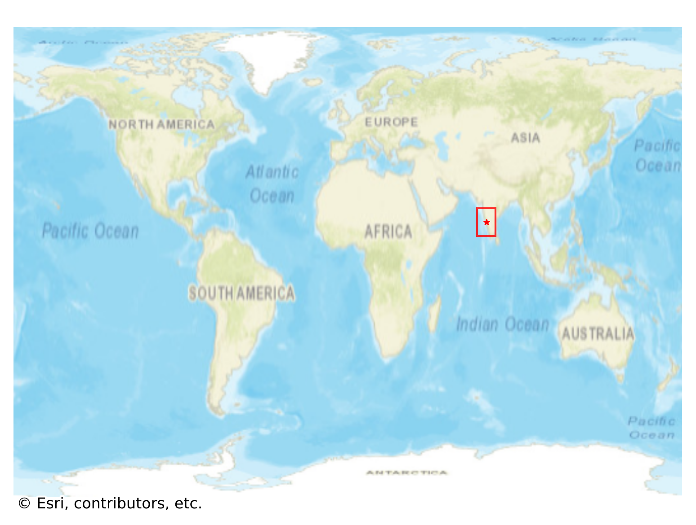
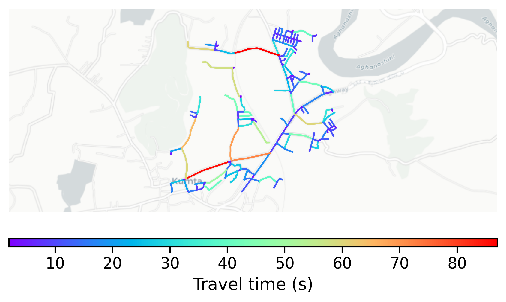

# Kumta, India

#### Location Information

- **City**: Kumta
- **Country**: India
- **Data Source**: OpenStreetMap

- **Analysis Date**: 2025-10-09

#### Road network topology

#### Network Characteristics

##### Basic Topology

- **Number of Nodes**: 160
- **Number of Edges**: 354
- **Network Density**: 0.013915
- **Average Node Degree**: 4.425
- **Standard Deviation of Node Degrees**: 2.030

##### Clustering Properties

- **Global Clustering Coefficient**: 0.040404
- **Average Local Clustering Coefficient**: 0.048333
- **Degree Assortativity Coefficient**: -0.255161

##### Spatial Metrics

- **Total Network Length (meters)**: 52722.76
- **Average Edge Length (meters)**: 148.93
- **Average Travel Time per Edge (seconds)**: 16.95

---
*Report generated on 2025-10-09 19:18:42*
