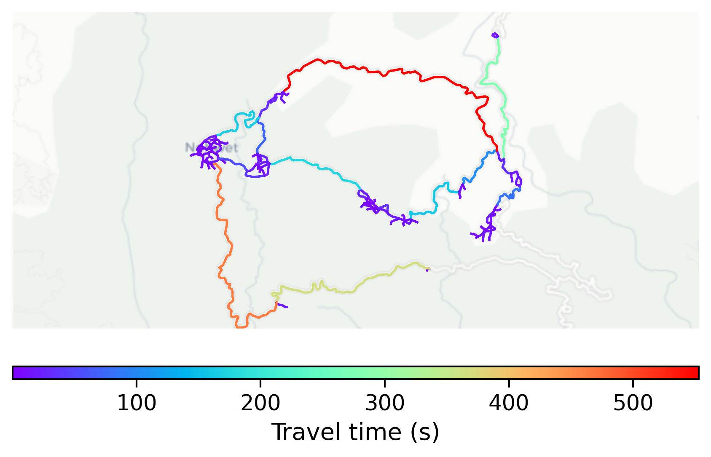

# Mawlynnong, India

#### Location Information

- **City**: Mawlynnong
- **Country**: India
- **Data Source**: OpenStreetMap

- **Analysis Date**: 2025-10-10

#### Road network topology

#### Network Characteristics

##### Basic Topology

- **Number of Nodes**: 140
- **Number of Edges**: 340
- **Network Density**: 0.017472
- **Average Node Degree**: 4.857
- **Standard Deviation of Node Degrees**: 1.807

##### Clustering Properties

- **Global Clustering Coefficient**: 0.042105
- **Average Local Clustering Coefficient**: 0.038333
- **Degree Assortativity Coefficient**: -0.100719

##### Spatial Metrics

- **Total Network Length (meters)**: 66185.22
- **Average Edge Length (meters)**: 194.66
- **Average Travel Time per Edge (seconds)**: 23.36

---
*Report generated on 2025-10-10 16:07:54*
