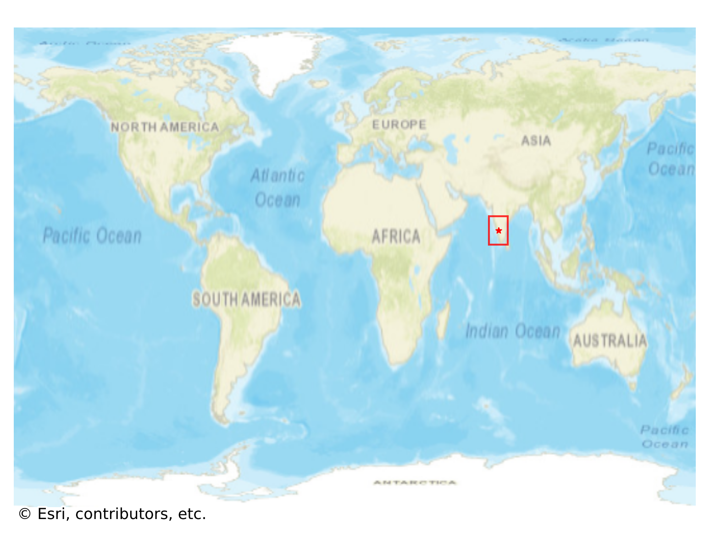

# Mudigere, India

#### Location Information

- **City**: Mudigere
- **Country**: India
- **Data Source**: OpenStreetMap

- **Analysis Date**: 2025-10-10

#### Road network topology

#### Network Characteristics

##### Basic Topology

- **Number of Nodes**: 395
- **Number of Edges**: 1,010
- **Network Density**: 0.006490
- **Average Node Degree**: 5.114
- **Standard Deviation of Node Degrees**: 2.033

##### Clustering Properties

- **Global Clustering Coefficient**: 0.052308
- **Average Local Clustering Coefficient**: 0.053819
- **Degree Assortativity Coefficient**: 0.032200

##### Spatial Metrics

- **Total Network Length (meters)**: 119386.28
- **Average Edge Length (meters)**: 118.20
- **Average Travel Time per Edge (seconds)**: 14.18

---
*Report generated on 2025-10-10 18:25:44*
