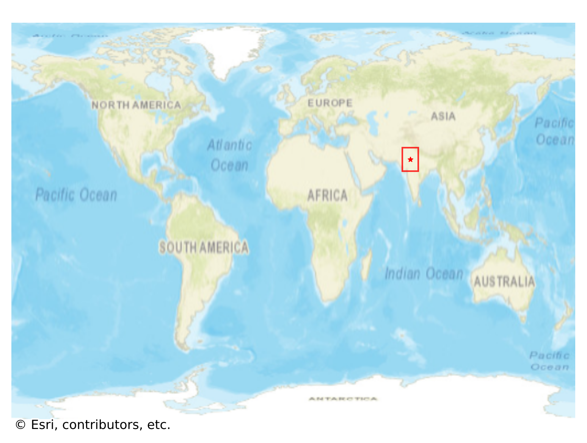
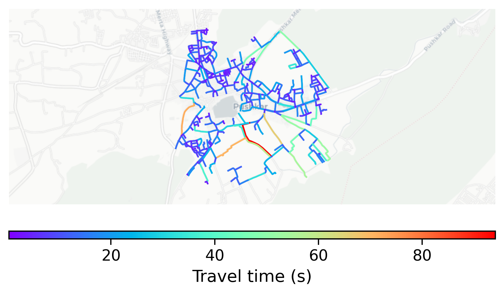

# Pushkar, India

#### Location Information

- **City**: Pushkar
- **Country**: India
- **Data Source**: OpenStreetMap

- **Analysis Date**: 2025-10-10

#### Road network topology

#### Network Characteristics

##### Basic Topology

- **Number of Nodes**: 408
- **Number of Edges**: 1,019
- **Network Density**: 0.006136
- **Average Node Degree**: 4.995
- **Standard Deviation of Node Degrees**: 1.852

##### Clustering Properties

- **Global Clustering Coefficient**: 0.054545
- **Average Local Clustering Coefficient**: 0.059140
- **Degree Assortativity Coefficient**: -0.061856

##### Spatial Metrics

- **Total Network Length (meters)**: 93302.31
- **Average Edge Length (meters)**: 91.56
- **Average Travel Time per Edge (seconds)**: 10.99

---
*Report generated on 2025-10-10 16:08:00*
