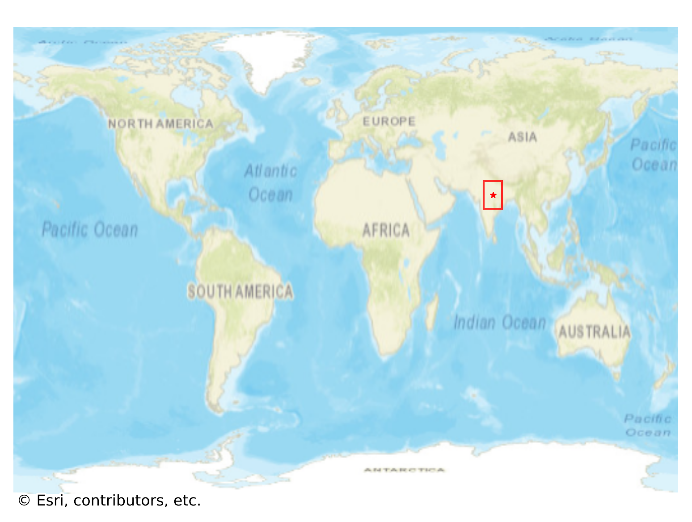
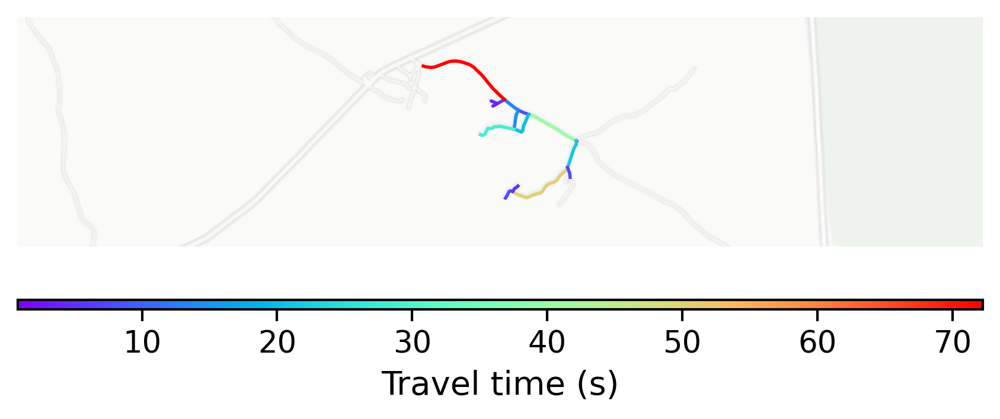

# Surkhi, India

#### Location Information

- **City**: Surkhi
- **Country**: India
- **Data Source**: OpenStreetMap

- **Analysis Date**: 2025-10-09

#### Road network topology

#### Network Characteristics

##### Basic Topology

- **Number of Nodes**: 16
- **Number of Edges**: 32
- **Network Density**: 0.133333
- **Average Node Degree**: 4.000
- **Standard Deviation of Node Degrees**: 2.000

##### Clustering Properties

- **Global Clustering Coefficient**: 0.125000
- **Average Local Clustering Coefficient**: 0.125000
- **Degree Assortativity Coefficient**: -0.333333

##### Spatial Metrics

- **Total Network Length (meters)**: 5099.81
- **Average Edge Length (meters)**: 159.37
- **Average Travel Time per Edge (seconds)**: 19.12

---
*Report generated on 2025-10-09 19:18:49*
