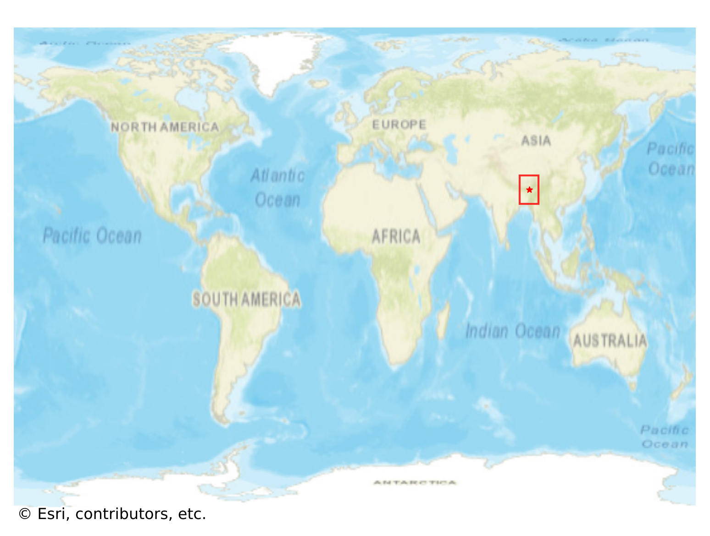
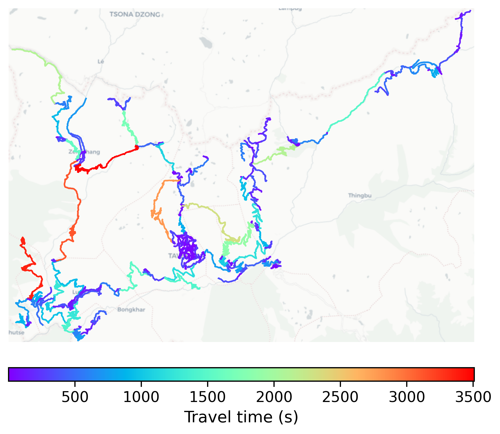

# Tawang, India

#### Location Information

- **City**: Tawang
- **Country**: India
- **Data Source**: OpenStreetMap

- **Analysis Date**: 2025-10-10

#### Road network topology

#### Network Characteristics

##### Basic Topology

- **Number of Nodes**: 367
- **Number of Edges**: 854
- **Network Density**: 0.006358
- **Average Node Degree**: 4.654
- **Standard Deviation of Node Degrees**: 1.927

##### Clustering Properties

- **Global Clustering Coefficient**: 0.031532
- **Average Local Clustering Coefficient**: 0.029289
- **Degree Assortativity Coefficient**: -0.191608

##### Spatial Metrics

- **Total Network Length (meters)**: 1682394.81
- **Average Edge Length (meters)**: 1970.02
- **Average Travel Time per Edge (seconds)**: 236.40

---
*Report generated on 2025-10-10 16:08:06*
