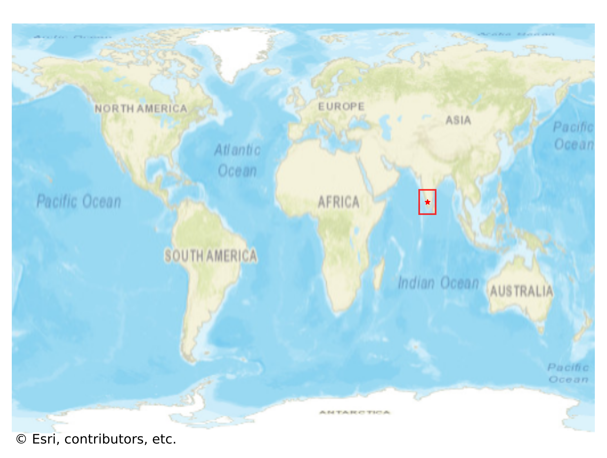

# Thenkara, India

#### Location Information

- **City**: Thenkara
- **Country**: India
- **Data Source**: OpenStreetMap

- **Analysis Date**: 2025-10-10

#### Road network topology

#### Network Characteristics

##### Basic Topology

- **Number of Nodes**: 272
- **Number of Edges**: 640
- **Network Density**: 0.008682
- **Average Node Degree**: 4.706
- **Standard Deviation of Node Degrees**: 1.963

##### Clustering Properties

- **Global Clustering Coefficient**: 0.060329
- **Average Local Clustering Coefficient**: 0.060688
- **Degree Assortativity Coefficient**: -0.129157

##### Spatial Metrics

- **Total Network Length (meters)**: 155754.55
- **Average Edge Length (meters)**: 243.37
- **Average Travel Time per Edge (seconds)**: 29.20

---
*Report generated on 2025-10-10 18:25:53*
