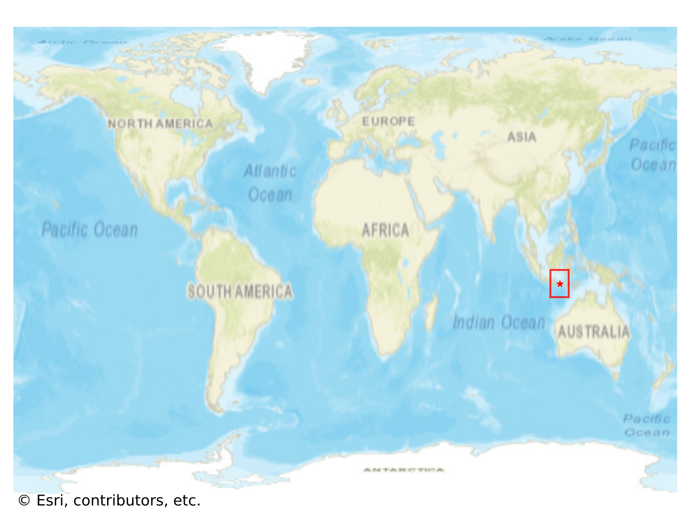
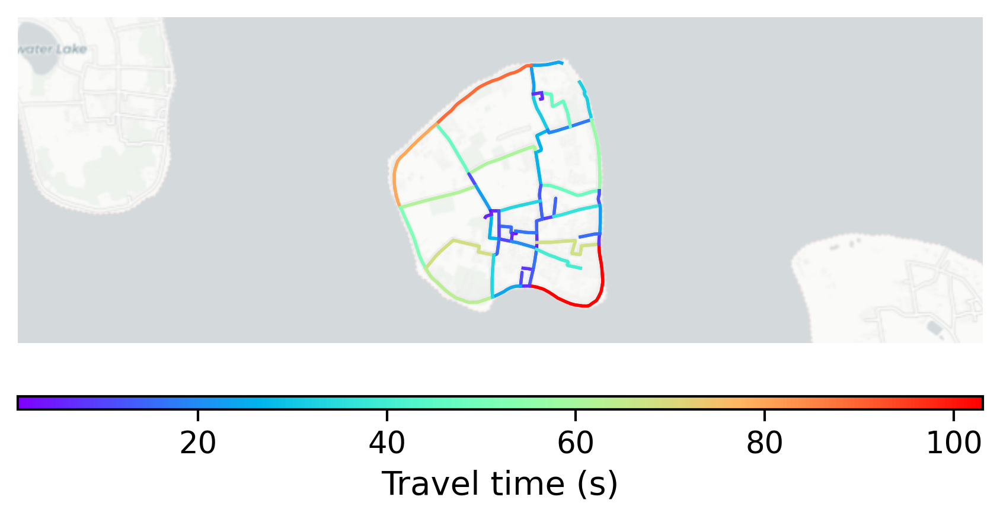

# Gili_Air, Indonesia

#### Location Information

- **City**: Gili_Air
- **Country**: Indonesia
- **Data Source**: OpenStreetMap

- **Analysis Date**: 2025-10-10

#### Road network topology

#### Network Characteristics

##### Basic Topology

- **Number of Nodes**: 47
- **Number of Edges**: 120
- **Network Density**: 0.055504
- **Average Node Degree**: 5.106
- **Standard Deviation of Node Degrees**: 1.741

##### Clustering Properties

- **Global Clustering Coefficient**: 0.027027
- **Average Local Clustering Coefficient**: 0.027778
- **Degree Assortativity Coefficient**: -0.059603

##### Spatial Metrics

- **Total Network Length (meters)**: 26643.15
- **Average Edge Length (meters)**: 222.03
- **Average Travel Time per Edge (seconds)**: 26.64

---
*Report generated on 2025-10-10 16:08:12*
