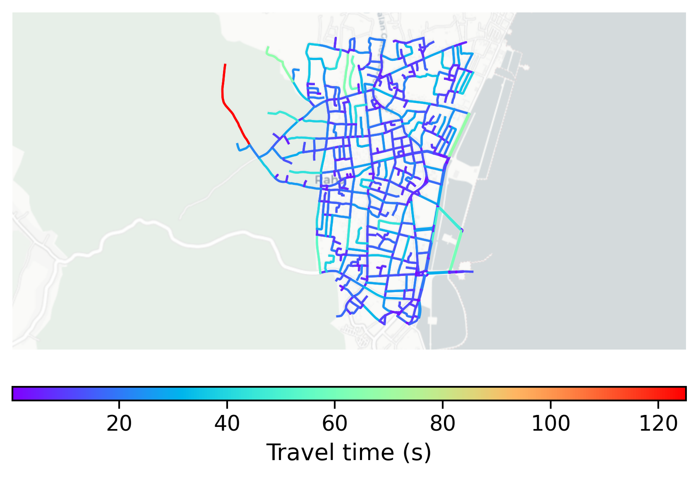

# Raha, Indonesia

#### Location Information

- **City**: Raha
- **Country**: Indonesia
- **Data Source**: OpenStreetMap

- **Analysis Date**: 2025-10-09

#### Road network topology

#### Network Characteristics

##### Basic Topology

- **Number of Nodes**: 540
- **Number of Edges**: 1,371
- **Network Density**: 0.004710
- **Average Node Degree**: 5.078
- **Standard Deviation of Node Degrees**: 1.767

##### Clustering Properties

- **Global Clustering Coefficient**: 0.045939
- **Average Local Clustering Coefficient**: 0.051339
- **Degree Assortativity Coefficient**: 0.161648

##### Spatial Metrics

- **Total Network Length (meters)**: 154364.95
- **Average Edge Length (meters)**: 112.59
- **Average Travel Time per Edge (seconds)**: 13.51

---
*Report generated on 2025-10-09 19:18:55*
