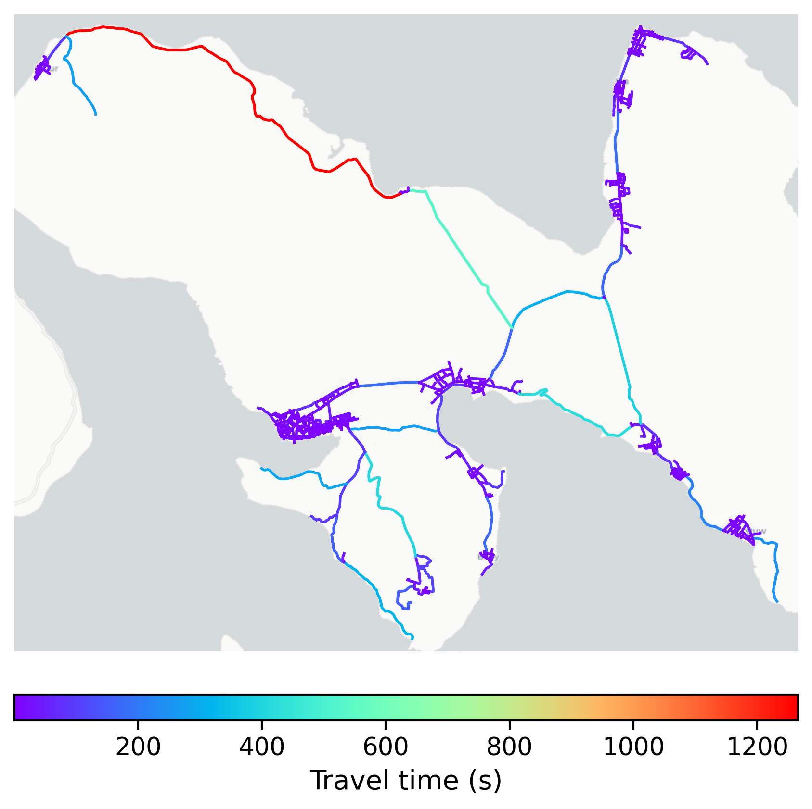

# Saparua, Indonesia

#### Location Information

- **City**: Saparua
- **Country**: Indonesia
- **Data Source**: OpenStreetMap

- **Analysis Date**: 2025-10-09

#### Road network topology

#### Network Characteristics

##### Basic Topology

- **Number of Nodes**: 577
- **Number of Edges**: 1,552
- **Network Density**: 0.004670
- **Average Node Degree**: 5.380
- **Standard Deviation of Node Degrees**: 2.034

##### Clustering Properties

- **Global Clustering Coefficient**: 0.056501
- **Average Local Clustering Coefficient**: 0.057808
- **Degree Assortativity Coefficient**: 0.030395

##### Spatial Metrics

- **Total Network Length (meters)**: 270298.75
- **Average Edge Length (meters)**: 174.16
- **Average Travel Time per Edge (seconds)**: 20.90

---
*Report generated on 2025-10-09 19:18:58*
