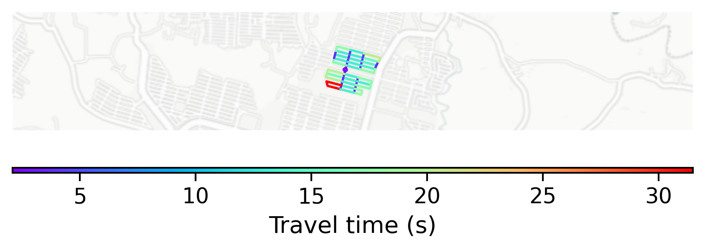

# Ubud, Indonesia

#### Location Information

- **City**: Ubud
- **Country**: Indonesia
- **Data Source**: OpenStreetMap

- **Analysis Date**: 2025-10-09

#### Road network topology

#### Network Characteristics

##### Basic Topology

- **Number of Nodes**: 32
- **Number of Edges**: 104
- **Network Density**: 0.104839
- **Average Node Degree**: 6.500
- **Standard Deviation of Node Degrees**: 1.658

##### Clustering Properties

- **Global Clustering Coefficient**: 0.193548
- **Average Local Clustering Coefficient**: 0.187500
- **Degree Assortativity Coefficient**: 0.302013

##### Spatial Metrics

- **Total Network Length (meters)**: 8809.86
- **Average Edge Length (meters)**: 84.71
- **Average Travel Time per Edge (seconds)**: 10.17

---
*Report generated on 2025-10-09 19:18:59*
