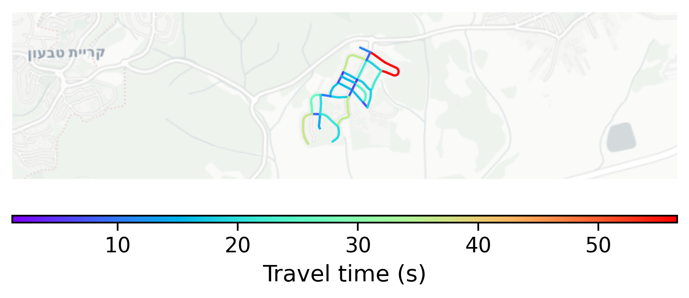

# Bethlehem, Israel

#### Location Information

- **City**: Bethlehem
- **Country**: Israel
- **Data Source**: OpenStreetMap

- **Analysis Date**: 2025-10-10

#### Road network topology

#### Network Characteristics

##### Basic Topology

- **Number of Nodes**: 23
- **Number of Edges**: 64
- **Network Density**: 0.126482
- **Average Node Degree**: 5.565
- **Standard Deviation of Node Degrees**: 1.861

##### Clustering Properties

- **Global Clustering Coefficient**: 0.179104
- **Average Local Clustering Coefficient**: 0.166667
- **Degree Assortativity Coefficient**: -0.076636

##### Spatial Metrics

- **Total Network Length (meters)**: 9417.18
- **Average Edge Length (meters)**: 147.14
- **Average Travel Time per Edge (seconds)**: 17.66

---
*Report generated on 2025-10-10 16:08:24*
