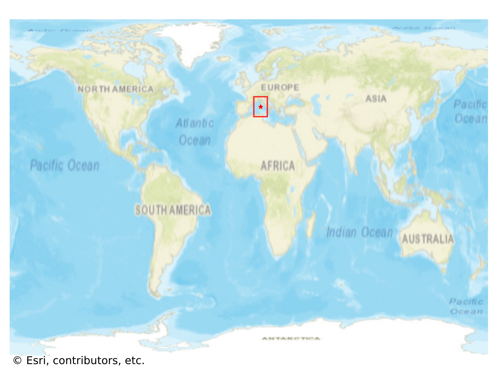
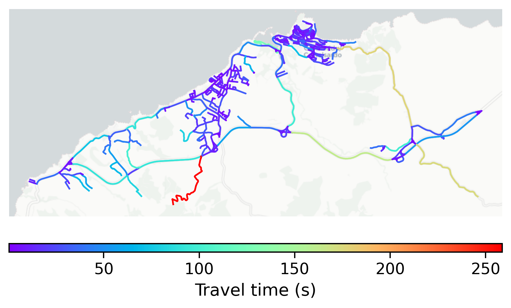

# Castelsardo, Italy

#### Location Information

- **City**: Castelsardo
- **Country**: Italy
- **Data Source**: OpenStreetMap

- **Analysis Date**: 2025-10-10

#### Road network topology

#### Network Characteristics

##### Basic Topology

- **Number of Nodes**: 404
- **Number of Edges**: 896
- **Network Density**: 0.005503
- **Average Node Degree**: 4.436
- **Standard Deviation of Node Degrees**: 1.791

##### Clustering Properties

- **Global Clustering Coefficient**: 0.071836
- **Average Local Clustering Coefficient**: 0.070922
- **Degree Assortativity Coefficient**: -0.149411

##### Spatial Metrics

- **Total Network Length (meters)**: 162808.24
- **Average Edge Length (meters)**: 181.71
- **Average Travel Time per Edge (seconds)**: 16.08

---
*Report generated on 2025-10-10 18:26:08*
