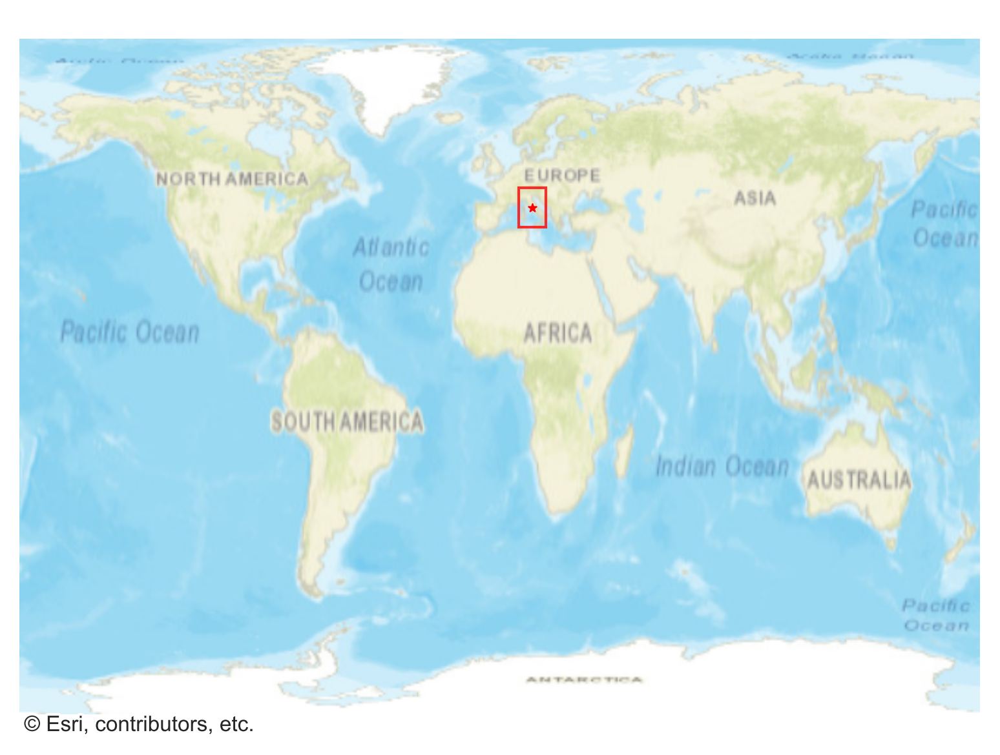
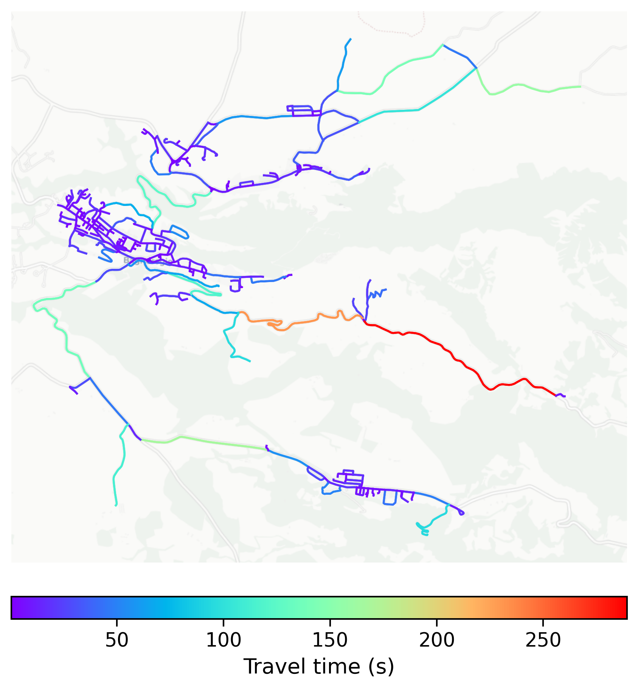

# Civita_di_Bagnoregio, Italy

#### Location Information

- **City**: Civita_di_Bagnoregio
- **Country**: Italy
- **Data Source**: OpenStreetMap

- **Analysis Date**: 2025-10-10

#### Road network topology

#### Network Characteristics

##### Basic Topology

- **Number of Nodes**: 308
- **Number of Edges**: 671
- **Network Density**: 0.007096
- **Average Node Degree**: 4.357
- **Standard Deviation of Node Degrees**: 1.875

##### Clustering Properties

- **Global Clustering Coefficient**: 0.049261
- **Average Local Clustering Coefficient**: 0.043689
- **Degree Assortativity Coefficient**: -0.081166

##### Spatial Metrics

- **Total Network Length (meters)**: 108663.22
- **Average Edge Length (meters)**: 161.94
- **Average Travel Time per Edge (seconds)**: 16.65

---
*Report generated on 2025-10-10 16:08:32*
