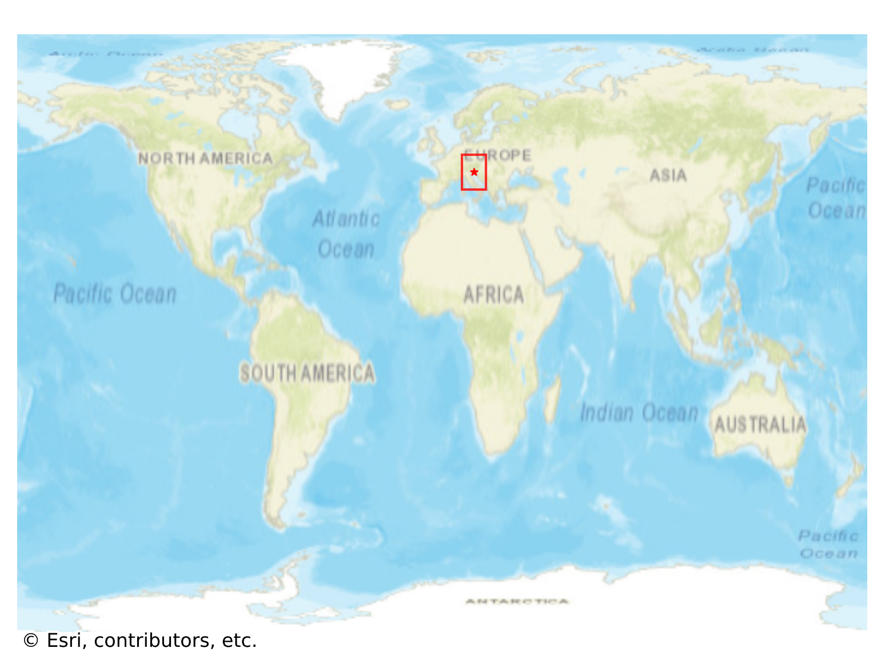
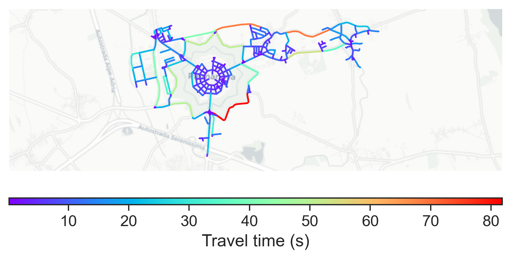

# Palmanova, Italy

#### Location Information

- **City**: Palmanova
- **Country**: Italy
- **Data Source**: OpenStreetMap

- **Analysis Date**: 2025-10-10

#### Road network topology

#### Network Characteristics

##### Basic Topology

- **Number of Nodes**: 306
- **Number of Edges**: 706
- **Network Density**: 0.007565
- **Average Node Degree**: 4.614
- **Standard Deviation of Node Degrees**: 1.779

##### Clustering Properties

- **Global Clustering Coefficient**: 0.108173
- **Average Local Clustering Coefficient**: 0.122807
- **Degree Assortativity Coefficient**: 0.112923

##### Spatial Metrics

- **Total Network Length (meters)**: 86307.23
- **Average Edge Length (meters)**: 122.25
- **Average Travel Time per Edge (seconds)**: 8.91

---
*Report generated on 2025-10-10 16:08:34*
