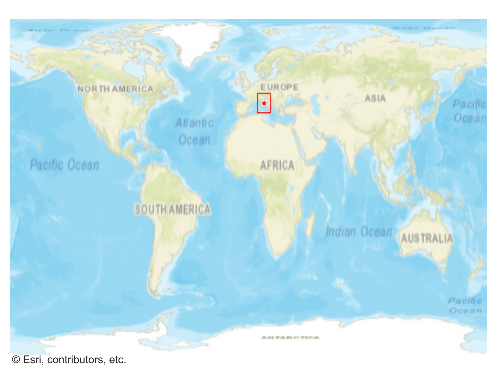
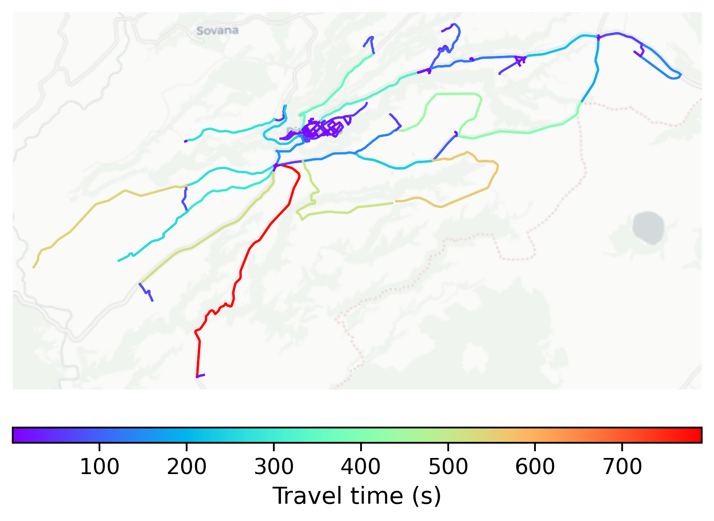

# Pitigliano, Italy

#### Location Information

- **City**: Pitigliano
- **Country**: Italy
- **Data Source**: OpenStreetMap

- **Analysis Date**: 2025-10-09

#### Road network topology

#### Network Characteristics

##### Basic Topology

- **Number of Nodes**: 152
- **Number of Edges**: 332
- **Network Density**: 0.014465
- **Average Node Degree**: 4.368
- **Standard Deviation of Node Degrees**: 1.673

##### Clustering Properties

- **Global Clustering Coefficient**: 0.120000
- **Average Local Clustering Coefficient**: 0.123611
- **Degree Assortativity Coefficient**: 0.212230

##### Spatial Metrics

- **Total Network Length (meters)**: 164148.99
- **Average Edge Length (meters)**: 494.42
- **Average Travel Time per Edge (seconds)**: 59.33

---
*Report generated on 2025-10-09 19:19:04*
