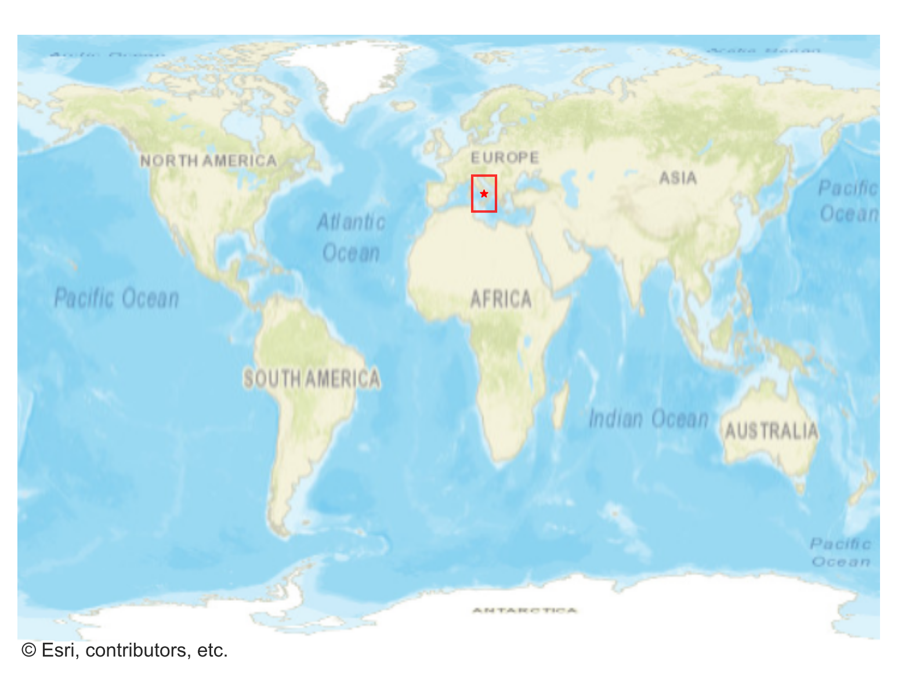
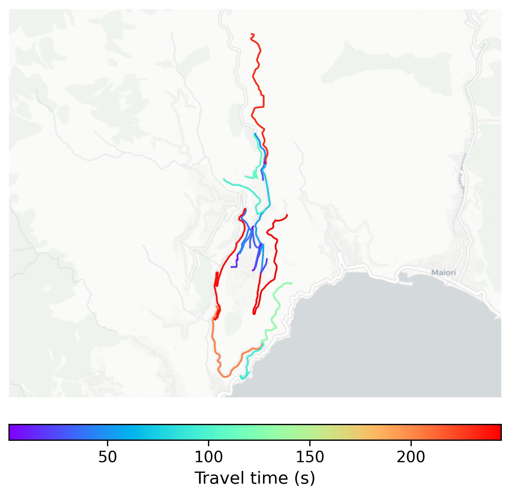

# Ravello, Italy

#### Location Information

- **City**: Ravello
- **Country**: Italy
- **Data Source**: OpenStreetMap

- **Analysis Date**: 2025-10-10

#### Road network topology

#### Network Characteristics

##### Basic Topology

- **Number of Nodes**: 30
- **Number of Edges**: 60
- **Network Density**: 0.068966
- **Average Node Degree**: 4.000
- **Standard Deviation of Node Degrees**: 1.807

##### Clustering Properties

- **Global Clustering Coefficient**: 0.065217
- **Average Local Clustering Coefficient**: 0.092593
- **Degree Assortativity Coefficient**: -0.187107

##### Spatial Metrics

- **Total Network Length (meters)**: 31942.47
- **Average Edge Length (meters)**: 532.37
- **Average Travel Time per Edge (seconds)**: 63.88

---
*Report generated on 2025-10-10 18:26:20*
