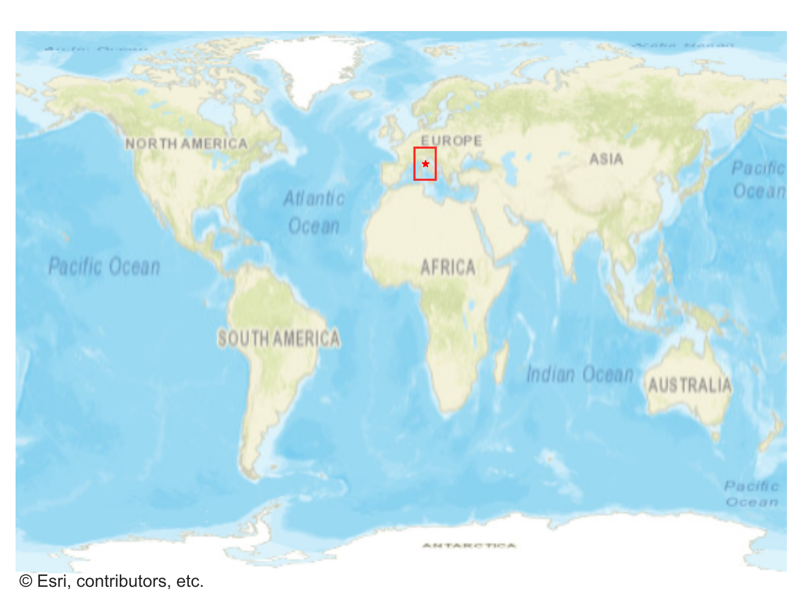
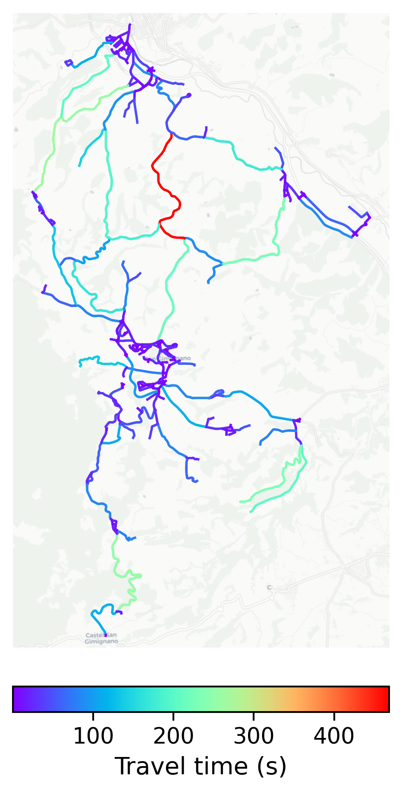

# San_Gimignano, Italy

#### Location Information

- **City**: San_Gimignano
- **Country**: Italy
- **Data Source**: OpenStreetMap

- **Analysis Date**: 2025-10-09

#### Road network topology

#### Network Characteristics

##### Basic Topology

- **Number of Nodes**: 398
- **Number of Edges**: 806
- **Network Density**: 0.005101
- **Average Node Degree**: 4.050
- **Standard Deviation of Node Degrees**: 1.595

##### Clustering Properties

- **Global Clustering Coefficient**: 0.184426
- **Average Local Clustering Coefficient**: 0.185010
- **Degree Assortativity Coefficient**: 0.159690

##### Spatial Metrics

- **Total Network Length (meters)**: 239954.43
- **Average Edge Length (meters)**: 297.71
- **Average Travel Time per Edge (seconds)**: 24.45

---
*Report generated on 2025-10-09 19:19:09*
