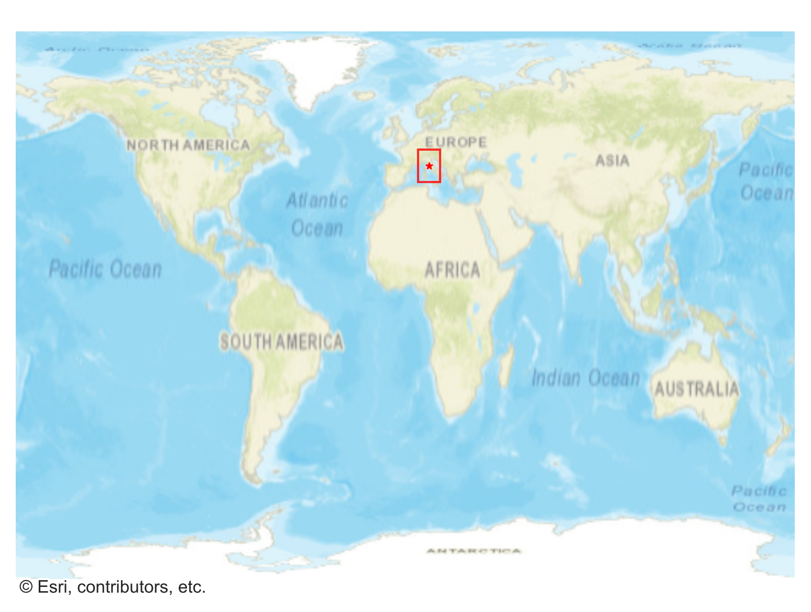
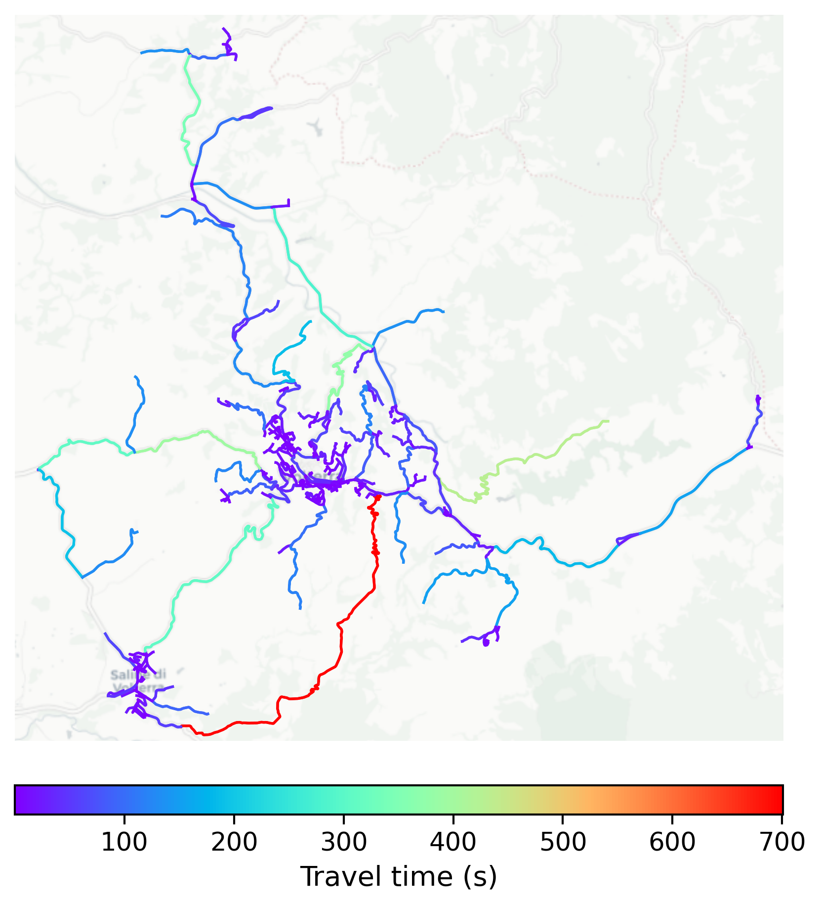

# Volterra, Italy

#### Location Information

- **City**: Volterra
- **Country**: Italy
- **Data Source**: OpenStreetMap

- **Analysis Date**: 2025-10-10

#### Road network topology

#### Network Characteristics

##### Basic Topology

- **Number of Nodes**: 454
- **Number of Edges**: 963
- **Network Density**: 0.004682
- **Average Node Degree**: 4.242
- **Standard Deviation of Node Degrees**: 1.833

##### Clustering Properties

- **Global Clustering Coefficient**: 0.109795
- **Average Local Clustering Coefficient**: 0.114583
- **Degree Assortativity Coefficient**: -0.135090

##### Spatial Metrics

- **Total Network Length (meters)**: 312930.09
- **Average Edge Length (meters)**: 324.95
- **Average Travel Time per Edge (seconds)**: 24.18

---
*Report generated on 2025-10-10 16:08:46*
