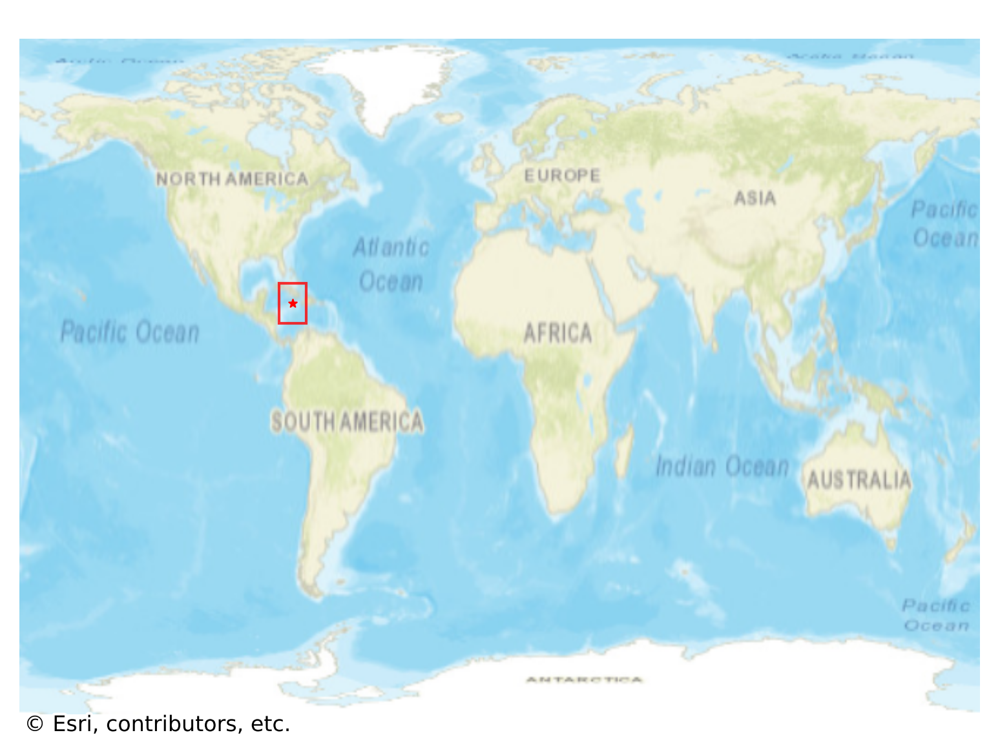
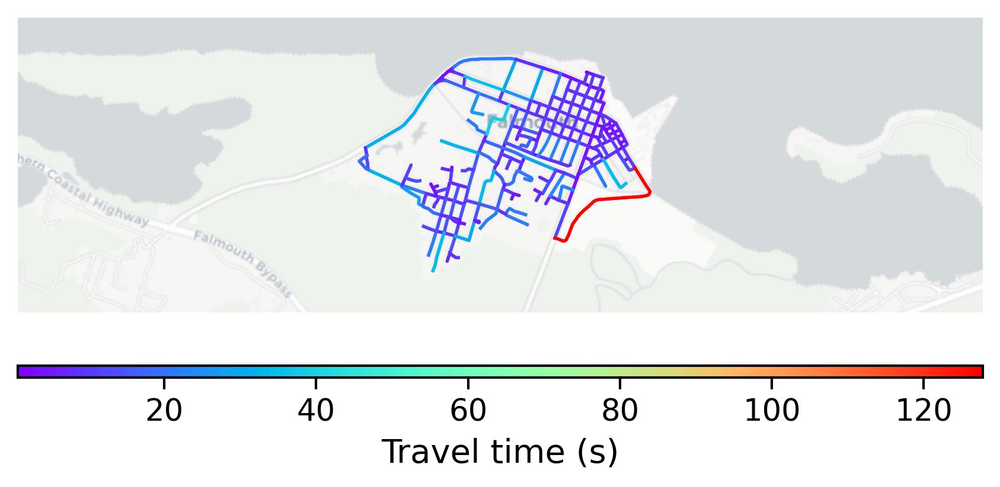

# Falmouth, Jamaica

#### Location Information

- **City**: Falmouth
- **Country**: Jamaica
- **Data Source**: OpenStreetMap

- **Analysis Date**: 2025-10-09

#### Road network topology

#### Network Characteristics

##### Basic Topology

- **Number of Nodes**: 199
- **Number of Edges**: 497
- **Network Density**: 0.012614
- **Average Node Degree**: 4.995
- **Standard Deviation of Node Degrees**: 1.758

##### Clustering Properties

- **Global Clustering Coefficient**: 0.037855
- **Average Local Clustering Coefficient**: 0.042169
- **Degree Assortativity Coefficient**: 0.151096

##### Spatial Metrics

- **Total Network Length (meters)**: 49071.77
- **Average Edge Length (meters)**: 98.74
- **Average Travel Time per Edge (seconds)**: 10.92

---
*Report generated on 2025-10-09 19:19:10*
