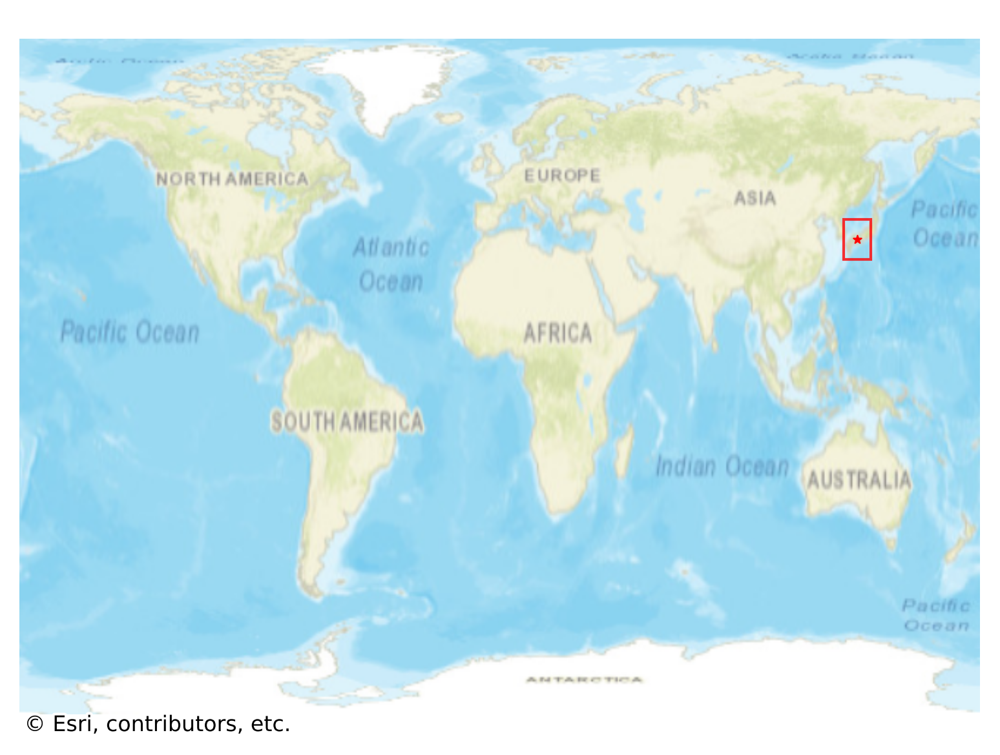

# Kurashiki_Bikan, Japan

#### Location Information

- **City**: Kurashiki_Bikan
- **Country**: Japan
- **Data Source**: OpenStreetMap

- **Analysis Date**: 2025-10-10

#### Road network topology

#### Network Characteristics

##### Basic Topology

- **Number of Nodes**: 29
- **Number of Edges**: 58
- **Network Density**: 0.071429
- **Average Node Degree**: 4.000
- **Standard Deviation of Node Degrees**: 1.682

##### Clustering Properties

- **Global Clustering Coefficient**: 0.063830
- **Average Local Clustering Coefficient**: 0.116667
- **Degree Assortativity Coefficient**: -0.220814

##### Spatial Metrics

- **Total Network Length (meters)**: 3940.16
- **Average Edge Length (meters)**: 67.93
- **Average Travel Time per Edge (seconds)**: 8.15

---
*Report generated on 2025-10-10 18:26:30*
