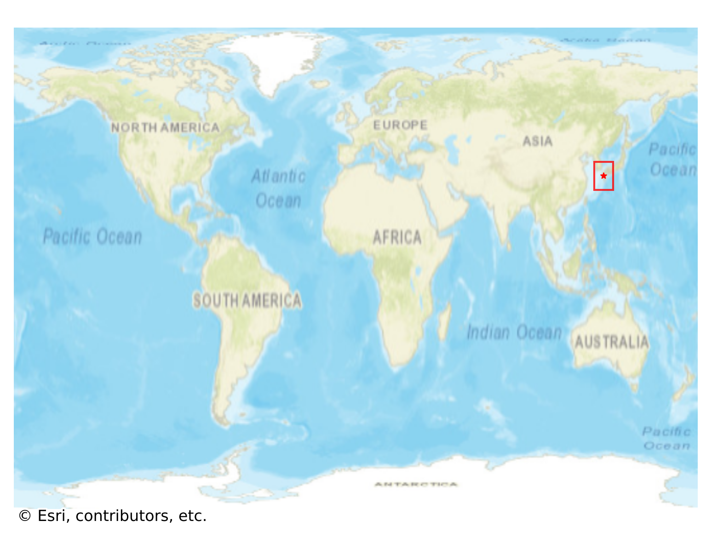
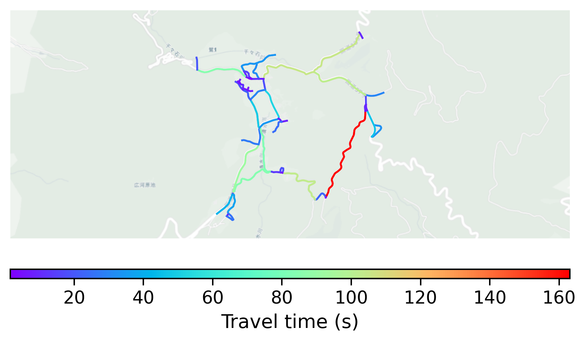

# Takanotsume, Japan

#### Location Information

- **City**: Takanotsume
- **Country**: Japan
- **Data Source**: OpenStreetMap

- **Analysis Date**: 2025-10-10

#### Road network topology

#### Network Characteristics

##### Basic Topology

- **Number of Nodes**: 51
- **Number of Edges**: 120
- **Network Density**: 0.047059
- **Average Node Degree**: 4.706
- **Standard Deviation of Node Degrees**: 1.807

##### Clustering Properties

- **Global Clustering Coefficient**: 0.094737
- **Average Local Clustering Coefficient**: 0.101852
- **Degree Assortativity Coefficient**: 0.019608

##### Spatial Metrics

- **Total Network Length (meters)**: 30065.06
- **Average Edge Length (meters)**: 250.54
- **Average Travel Time per Edge (seconds)**: 30.07

---
*Report generated on 2025-10-10 18:26:32*
