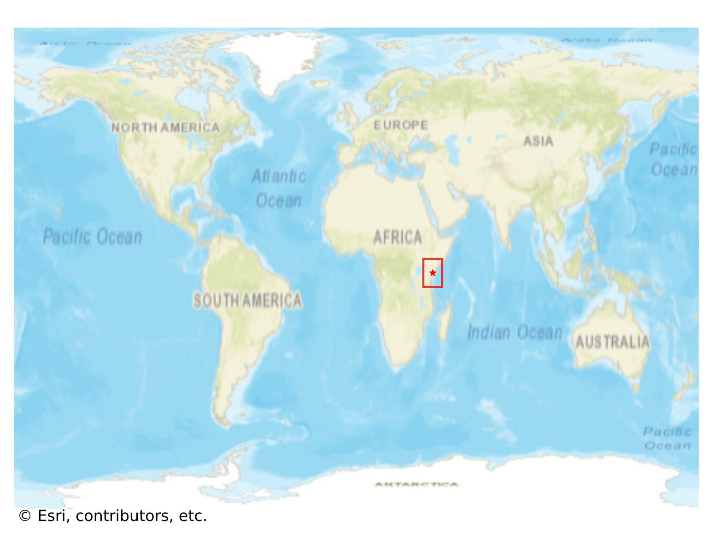
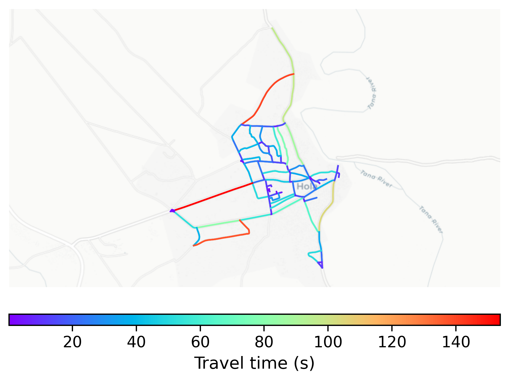

# Hola, Kenya

#### Location Information

- **City**: Hola
- **Country**: Kenya
- **Data Source**: OpenStreetMap

- **Analysis Date**: 2025-10-09

#### Road network topology

#### Network Characteristics

##### Basic Topology

- **Number of Nodes**: 92
- **Number of Edges**: 234
- **Network Density**: 0.027950
- **Average Node Degree**: 5.087
- **Standard Deviation of Node Degrees**: 1.685

##### Clustering Properties

- **Global Clustering Coefficient**: 0.076271
- **Average Local Clustering Coefficient**: 0.100000
- **Degree Assortativity Coefficient**: 0.159767

##### Spatial Metrics

- **Total Network Length (meters)**: 49520.36
- **Average Edge Length (meters)**: 211.63
- **Average Travel Time per Edge (seconds)**: 25.40

---
*Report generated on 2025-10-09 19:19:15*
