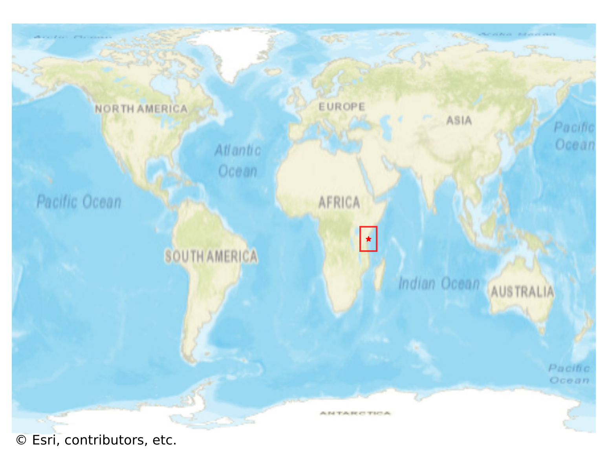
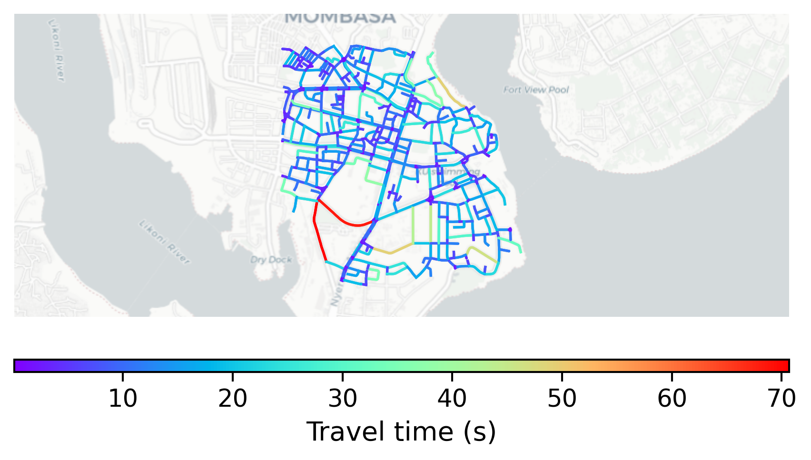

# Mombasa_Old_Town, Kenya

#### Location Information

- **City**: Mombasa_Old_Town
- **Country**: Kenya
- **Data Source**: OpenStreetMap

- **Analysis Date**: 2025-10-10

#### Road network topology

#### Network Characteristics

##### Basic Topology

- **Number of Nodes**: 598
- **Number of Edges**: 1,324
- **Network Density**: 0.003709
- **Average Node Degree**: 4.428
- **Standard Deviation of Node Degrees**: 1.598

##### Clustering Properties

- **Global Clustering Coefficient**: 0.071125
- **Average Local Clustering Coefficient**: 0.074906
- **Degree Assortativity Coefficient**: 0.354850

##### Spatial Metrics

- **Total Network Length (meters)**: 103178.22
- **Average Edge Length (meters)**: 77.93
- **Average Travel Time per Edge (seconds)**: 9.35

---
*Report generated on 2025-10-10 16:08:58*
