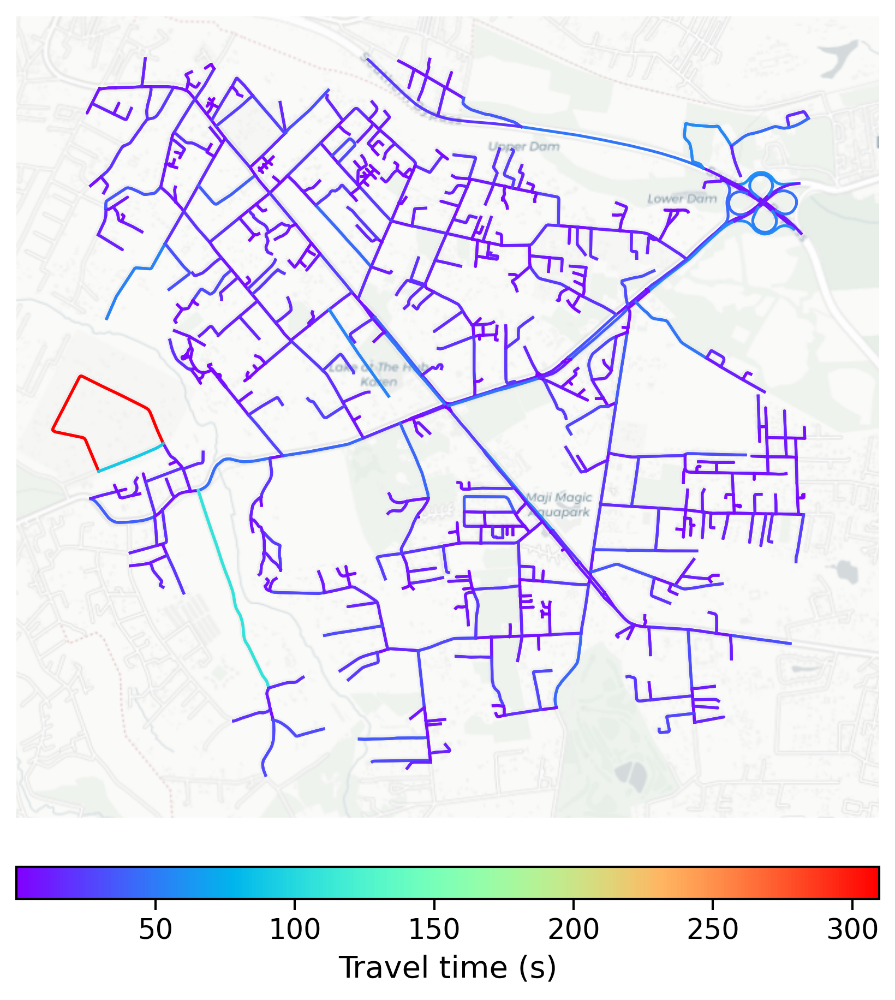

# Nairobi_City_Center, Kenya

#### Location Information

- **City**: Nairobi_City_Center
- **Country**: Kenya
- **Data Source**: OpenStreetMap

- **Analysis Date**: 2025-10-10

#### Road network topology

#### Network Characteristics

##### Basic Topology

- **Number of Nodes**: 787
- **Number of Edges**: 1,628
- **Network Density**: 0.002632
- **Average Node Degree**: 4.137
- **Standard Deviation of Node Degrees**: 1.960

##### Clustering Properties

- **Global Clustering Coefficient**: 0.023673
- **Average Local Clustering Coefficient**: 0.023454
- **Degree Assortativity Coefficient**: -0.162230

##### Spatial Metrics

- **Total Network Length (meters)**: 246788.27
- **Average Edge Length (meters)**: 151.59
- **Average Travel Time per Edge (seconds)**: 11.26

---
*Report generated on 2025-10-10 18:26:39*
