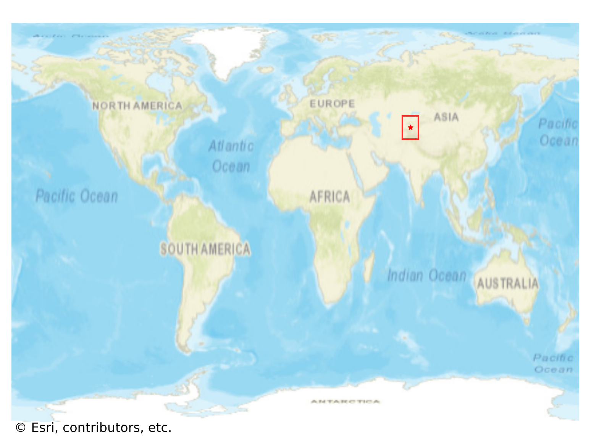
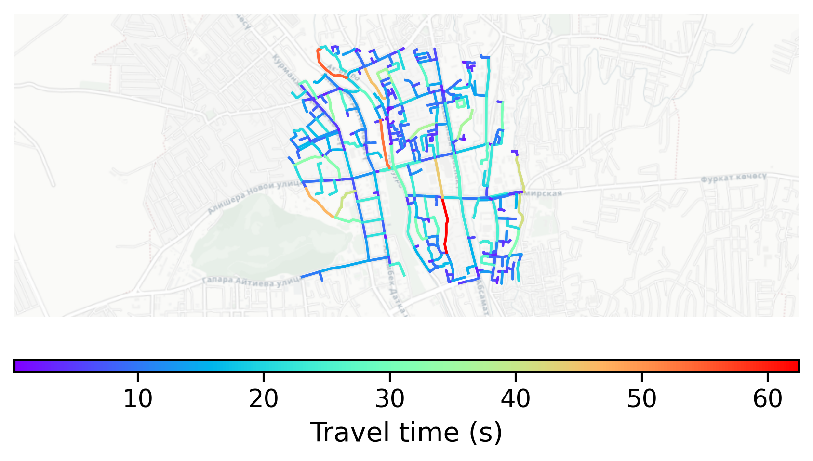

# Gulcha, Kyrgyzstan

#### Location Information

- **City**: Gulcha
- **Country**: Kyrgyzstan
- **Data Source**: OpenStreetMap

- **Analysis Date**: 2025-10-09

#### Road network topology

#### Network Characteristics

##### Basic Topology

- **Number of Nodes**: 370
- **Number of Edges**: 798
- **Network Density**: 0.005845
- **Average Node Degree**: 4.314
- **Standard Deviation of Node Degrees**: 1.868

##### Clustering Properties

- **Global Clustering Coefficient**: 0.035111
- **Average Local Clustering Coefficient**: 0.027404
- **Degree Assortativity Coefficient**: -0.047825

##### Spatial Metrics

- **Total Network Length (meters)**: 85485.23
- **Average Edge Length (meters)**: 107.12
- **Average Travel Time per Edge (seconds)**: 11.34

---
*Report generated on 2025-10-09 19:19:23*
