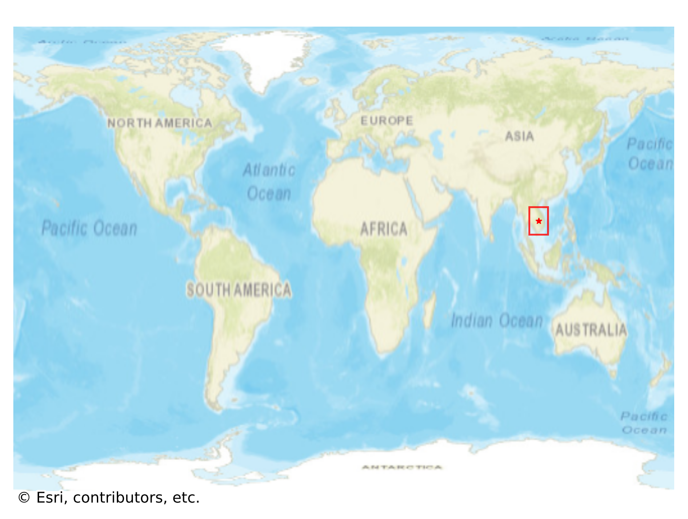

# Don_Khon, Laos

#### Location Information

- **City**: Don_Khon
- **Country**: Laos
- **Data Source**: OpenStreetMap

- **Analysis Date**: 2025-10-10

#### Road network topology

#### Network Characteristics

##### Basic Topology

- **Number of Nodes**: 33
- **Number of Edges**: 76
- **Network Density**: 0.071970
- **Average Node Degree**: 4.606
- **Standard Deviation of Node Degrees**: 1.874

##### Clustering Properties

- **Global Clustering Coefficient**: 0.046875
- **Average Local Clustering Coefficient**: 0.045455
- **Degree Assortativity Coefficient**: -0.197260

##### Spatial Metrics

- **Total Network Length (meters)**: 37841.36
- **Average Edge Length (meters)**: 497.91
- **Average Travel Time per Edge (seconds)**: 59.75

---
*Report generated on 2025-10-10 16:09:08*
